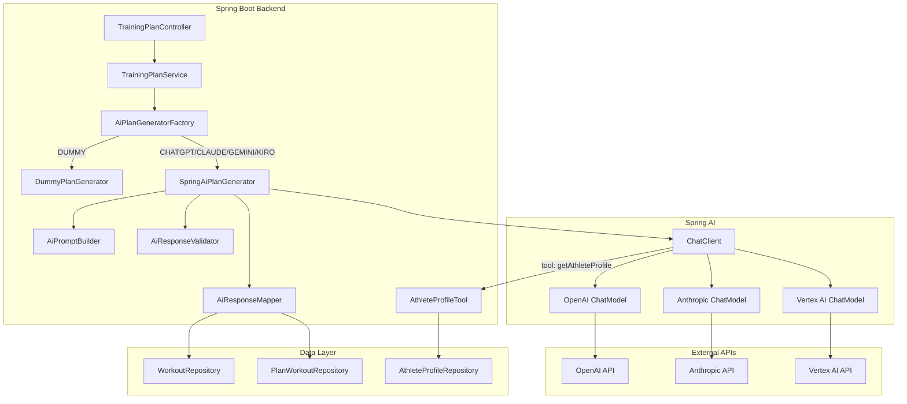
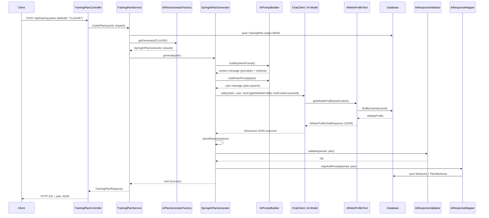

# Design Document: ai-integration

## Overview

This feature integrates real AI models (ChatGPT, Claude, Gemini, Kiro) into the training plan generation flow using Spring AI. The design introduces a strategy pattern with a factory for resolving model-specific implementations, Spring AI's `ChatClient` for unified model communication, tool calling (via `@Tool` annotation) to expose athlete profile data, and structured JSON output that maps to existing Workout/PlanWorkout entities.

Key design decisions:

- **Strategy + Factory pattern**: A generic `AiPlanGenerator` interface with a factory that resolves the correct implementation based on the `AiModel` enum. This decouples the `TrainingPlanService` from specific AI providers.
- **Spring AI `ChatClient` with `@Tool`**: Rather than full MCP server infrastructure, we use Spring AI's native tool calling mechanism. The `getAthleteProfile` tool is registered per-request via `ChatClient.tools()`, scoped to the current generation call. This is simpler, more testable, and achieves the same goal — the AI model calls a tool to retrieve athlete data.
- **`ToolContext` for user scoping**: The authenticated user's ID is passed via `ToolContext` so the tool always returns data for the correct user without accepting user parameters from the model.
- **Structured output via `BeanOutputConverter`**: The AI response is parsed into a Java record (`AiPlanResponse`) using Spring AI's structured output converter, providing type-safe deserialization with JSON schema enforcement.
- **Single shared prompt template**: All non-DUMMY implementations share the same prompt (system + user messages). The system message embeds the training principles document. Only the underlying `ChatModel` bean differs per provider.
- **Training principles as classpath resource**: Stored at `src/main/resources/prompts/training-principles.md` and loaded once at startup, allowing coaching guidelines to be updated without code changes.
- **Transactional safety**: The entire generation flow (AI call → parse → validate → persist) runs in a single `@Transactional` boundary. Any failure rolls back completely.

---

## Architecture



**Request flow:**

1. `POST /api/training-plans` arrives with `aiModel = CLAUDE` (for example).
2. `TrainingPlanService` saves the `TrainingPlan` entity (state = NEW), then calls `AiPlanGeneratorFactory.getGenerator(AiModel.CLAUDE)`.
3. The factory returns `SpringAiPlanGenerator` configured with the Claude `ChatModel`.
4. `SpringAiPlanGenerator` builds the prompt via `AiPromptBuilder` (system message with training principles + user message with plan parameters + JSON schema instructions).
5. It invokes `ChatClient` with the prompt, registering `AthleteProfileTool` as a tool and passing the user ID via `ToolContext`.
6. The AI model calls `getAthleteProfile` → Spring AI intercepts → `AthleteProfileTool` fetches the profile from the database → returns it to the model.
7. The model generates a structured JSON response.
8. `AiResponseValidator` validates the parsed response (enum values, week ranges, required fields).
9. `AiResponseMapper` creates `Workout` and `PlanWorkout` entities and persists them.
10. Control returns to `TrainingPlanService`, which commits the transaction and returns the plan response.

---

## Components and Interfaces

### Package: `com.trainer.ai`

#### `AiPlanGenerator` (Interface)

```java
public interface AiPlanGenerator {
    /**
     * Generates workouts and schedules them into the given training plan.
     * Persists Workout and PlanWorkout entities as a side-effect.
     *
     * @param plan the saved TrainingPlan entity (must have an ID and userId)
     * @throws AiGenerationException if the AI model fails or returns invalid data
     */
    void generate(TrainingPlan plan);
}
```

#### `AiPlanGeneratorFactory` (Spring Component)

```java
@Component
public class AiPlanGeneratorFactory {

    private final Map<AiModel, AiPlanGenerator> generators;
    private final AiModelProperties aiModelProperties;

    /**
     * Resolves the correct AiPlanGenerator for the given model.
     * @throws AiModelNotAvailableException if the model is disabled or not configured
     * @throws AiModelNotSupportedException if no implementation exists for the model
     */
    public AiPlanGenerator getGenerator(AiModel aiModel) { ... }
}
```

Resolution logic:
- `DUMMY` → returns `DummyPlanGenerator` (no configuration check)
- `CHATGPT`, `CLAUDE`, `GEMINI`, `KIRO` → checks enabled flag and API key presence, then returns the `SpringAiPlanGenerator` configured with the appropriate `ChatModel`

#### `SpringAiPlanGenerator` (implements `AiPlanGenerator`)

```java
public class SpringAiPlanGenerator implements AiPlanGenerator {

    private final ChatModel chatModel;
    private final AiPromptBuilder promptBuilder;
    private final AthleteProfileTool athleteProfileTool;
    private final AiResponseValidator responseValidator;
    private final AiResponseMapper responseMapper;

    @Override
    public void generate(TrainingPlan plan) {
        ChatClient client = ChatClient.create(chatModel);

        String response = client.prompt()
            .system(promptBuilder.buildSystemPrompt())
            .user(promptBuilder.buildUserPrompt(plan))
            .tools(athleteProfileTool)
            .toolContext(Map.of("userId", plan.getUserId()))
            .call()
            .content();

        AiPlanResponse parsed = parseResponse(response);
        responseValidator.validate(parsed, plan);
        responseMapper.mapAndPersist(parsed, plan);
    }
}
```

One instance per AI model is created as a Spring bean via `AiConfiguration`.

#### `AiPromptBuilder` (Spring Component)

```java
@Component
public class AiPromptBuilder {

    private final String trainingPrinciples; // loaded from classpath resource

    /** System prompt: training principles + role instructions + response schema */
    public String buildSystemPrompt() { ... }

    /** User prompt: plan parameters (event, distance, duration, pace, days, etc.) */
    public String buildUserPrompt(TrainingPlan plan) { ... }
}
```

The system prompt includes:
1. Role definition ("You are an expert running coach...")
2. Full training principles document (loaded from `classpath:prompts/training-principles.md`)
3. Instruction to call `getAthleteProfile` tool
4. JSON response schema specification

The user prompt includes:
- Event name, distance (human-readable), duration (weeks), race date
- Target pace (MM:SS/km format)
- Training days (day names), long run day (day name)
- Instruction to generate one workout per training day per week

#### `AthleteProfileTool` (Spring Component)

```java
@Component
public class AthleteProfileTool {

    private final AthleteProfileRepository athleteProfileRepository;

    @Tool(description = "Retrieve the athlete's fitness profile including heart rate zones, " +
            "threshold pace, race times, and biometric data. Call this before generating the plan.")
    public AthleteProfileToolResponse getAthleteProfile(ToolContext toolContext) {
        Long userId = (Long) toolContext.getContext().get("userId");
        AthleteProfile profile = athleteProfileRepository.findByUserId(userId)
            .orElseThrow(() -> new AthleteProfileNotFoundException(
                "No athlete profile exists for this user"));
        return mapToResponse(profile);
    }
}
```

The tool takes no model-visible parameters. The user ID comes from `ToolContext` (injected by the application, invisible to the AI model). This ensures the model cannot request another user's profile.

#### `AthleteProfileToolResponse` (Record)

```java
public record AthleteProfileToolResponse(
    LocalDate dateOfBirth,
    BigDecimal weightKg,
    Integer restingHR,
    Integer maxHR,
    Integer lthr,
    Integer thresholdPaceSecondsPerKm,
    BigDecimal vo2Max,
    Integer fiveKSeconds,
    Integer tenKSeconds,
    Integer halfMarathonSeconds,
    Integer marathonSeconds
) {}
```

Null fields are included in the JSON serialization (the model handles missing data gracefully per the training principles).

#### `AiResponseValidator` (Spring Component)

```java
@Component
public class AiResponseValidator {

    /**
     * Validates the parsed AI response against plan constraints.
     * @throws AiResponseValidationException with details about which fields failed
     */
    public void validate(AiPlanResponse response, TrainingPlan plan) { ... }
}
```

Validation rules:
- `workouts` array is non-empty
- Each workout has a non-blank `name` (max 50 chars)
- Each workout has at least 1 step
- `sportType` matches `SportType` enum
- `subSport` is null or matches `SubSport` enum
- Each step has valid `intensity`, `durationType`, `targetType` enum values
- `weekNumber` is between 1 and `plan.getDuration().getWeeks()`
- `dayOfWeek` is between 1 and 7
- `orderInDay` is between 1 and 10
- `stepOrder` values are sequential starting at 1
- `durationValue` is within valid ranges per `durationType`

#### `AiResponseMapper` (Spring Component)

```java
@Component
public class AiResponseMapper {

    private final WorkoutRepository workoutRepository;
    private final PlanWorkoutRepository planWorkoutRepository;

    /**
     * Maps the validated AI response to Workout and PlanWorkout entities
     * and persists them.
     */
    public void mapAndPersist(AiPlanResponse response, TrainingPlan plan) { ... }
}
```

For each workout in the response:
1. Creates a `Workout` entity with `userId = plan.getUserId()`, `sportType`, `subSport`, `name`, `numValidSteps = steps.size()`
2. Creates `WorkoutStep` entities from the step array
3. Saves the workout (cascades to steps)
4. Creates a `PlanWorkout` linking the workout to the plan with scheduling metadata

#### `AiConfiguration` (Spring Configuration)

```java
@Configuration
public class AiConfiguration {

    @Bean
    @ConditionalOnProperty(name = "trainer.ai.chatgpt.enabled", havingValue = "true")
    public SpringAiPlanGenerator chatgptPlanGenerator(
            @Qualifier("openAiChatModel") ChatModel chatModel, ...) { ... }

    @Bean
    @ConditionalOnProperty(name = "trainer.ai.claude.enabled", havingValue = "true")
    public SpringAiPlanGenerator claudePlanGenerator(
            @Qualifier("anthropicChatModel") ChatModel chatModel, ...) { ... }

    @Bean
    @ConditionalOnProperty(name = "trainer.ai.gemini.enabled", havingValue = "true")
    public SpringAiPlanGenerator geminiPlanGenerator(
            @Qualifier("vertexAiChatModel") ChatModel chatModel, ...) { ... }

    @Bean
    @ConditionalOnProperty(name = "trainer.ai.kiro.enabled", havingValue = "true")
    public SpringAiPlanGenerator kiroPlanGenerator(
            @Qualifier("openAiChatModel") ChatModel kiroModel, ...) { ... }
}
```

Each bean is conditionally created based on the enabled flag. The factory collects all available `SpringAiPlanGenerator` beans and maps them by `AiModel`.

#### Exception Classes

| Exception | HTTP Status | Description |
|-----------|-------------|-------------|
| `AiModelNotAvailableException` | 400 | Model is disabled or API key not configured |
| `AiModelNotSupportedException` | 400 | No implementation registered for the model |
| `AiGenerationException` | 502 | AI provider returned an error (4xx/5xx) |
| `AiGenerationTimeoutException` | 504 | AI provider did not respond within 60 seconds |
| `AiResponseValidationException` | 502 | AI response failed validation |
| `AiResponseParseException` | 502 | AI response could not be parsed as JSON |
| `AthleteProfileNotFoundException` | 400 | User has no athlete profile |

---

### Changes to Existing Components

#### `TrainingPlanService` (modified)

```java
@Service
public class TrainingPlanService {

    private final AiPlanGeneratorFactory aiPlanGeneratorFactory;
    // ... existing dependencies (remove direct DummyPlanGenerator reference)

    @Transactional
    public TrainingPlanResponse createPlan(Long userId, CreateTrainingPlanRequest request) {
        // ... existing validation and plan creation ...

        TrainingPlan saved = trainingPlanRepository.save(plan);

        // NEW: delegate to factory instead of conditional
        AiPlanGenerator generator = aiPlanGeneratorFactory.getGenerator(aiModel);
        generator.generate(saved);

        return toResponse(saved);
    }
}
```

#### `DummyPlanGenerator` (modified)

Implements `AiPlanGenerator` interface. No changes to internal logic:

```java
@Component
public class DummyPlanGenerator implements AiPlanGenerator {
    // ... existing implementation unchanged ...
}
```

---

## Data Models

### AI Response DTOs (package `com.trainer.ai`)

#### `AiPlanResponse`

```java
public record AiPlanResponse(
    List<AiWorkoutResponse> workouts
) {}
```

#### `AiWorkoutResponse`

```java
public record AiWorkoutResponse(
    String name,
    String sportType,
    String subSport,
    List<AiWorkoutStepResponse> steps,
    AiScheduleResponse schedule
) {}
```

#### `AiWorkoutStepResponse`

```java
public record AiWorkoutStepResponse(
    Integer stepOrder,
    String stepName,
    String intensity,
    String durationType,
    Integer durationValue,
    String targetType,
    Integer targetValueLow,
    Integer targetValueHigh
) {}
```

#### `AiScheduleResponse`

```java
public record AiScheduleResponse(
    Integer weekNumber,
    Integer dayOfWeek,
    Integer orderInDay
) {}
```

### JSON Response Schema (embedded in system prompt)

```json
{
  "workouts": [
    {
      "name": "Easy Run 40min",
      "sportType": "RUNNING",
      "subSport": null,
      "steps": [
        {
          "stepOrder": 1,
          "stepName": "Warm Up",
          "intensity": "WARMUP",
          "durationType": "TIME",
          "durationValue": 600,
          "targetType": "OPEN",
          "targetValueLow": null,
          "targetValueHigh": null
        }
      ],
      "schedule": {
        "weekNumber": 1,
        "dayOfWeek": 1,
        "orderInDay": 1
      }
    }
  ]
}
```

### Configuration Properties

```yaml
trainer:
  ai:
    chatgpt:
      enabled: false
      api-key: ${OPENAI_API_KEY:}
      model: gpt-4o
    claude:
      enabled: false
      api-key: ${ANTHROPIC_API_KEY:}
      model: claude-sonnet-4-20250514
    gemini:
      enabled: false
      api-key: ${GOOGLE_AI_API_KEY:}
      model: gemini-2.0-flash
    kiro:
      enabled: false
      api-key: ${KIRO_API_KEY:}
      model: kiro-v1
```

Mapped to a `@ConfigurationProperties` class:

```java
@ConfigurationProperties(prefix = "trainer.ai")
public record AiModelProperties(
    ModelConfig chatgpt,
    ModelConfig claude,
    ModelConfig gemini,
    ModelConfig kiro
) {
    public record ModelConfig(
        boolean enabled,
        String apiKey,
        String model
    ) {
        public boolean isAvailable() {
            return enabled && apiKey != null && !apiKey.isBlank();
        }
    }
}
```

### Sequence Diagram: AI Plan Generation



---

## Correctness Properties

*A property is a characteristic or behavior that should hold true across all valid executions of a system — essentially, a formal statement about what the system should do. Properties serve as the bridge between human-readable specifications and machine-verifiable correctness guarantees.*

### Property 1: Athlete profile tool returns complete data

*For any* `AthleteProfile` entity with an arbitrary combination of null and non-null optional fields (lthr, thresholdPaceSecondsPerKm, vo2Max, fiveKSeconds, tenKSeconds, halfMarathonSeconds, marathonSeconds), when the `getAthleteProfile` tool is invoked with the correct userId in `ToolContext`, the returned `AthleteProfileToolResponse` SHALL contain all fields matching the entity values exactly, with null fields serialized as JSON null.

**Validates: Requirements 2.1, 2.2**

### Property 2: Athlete profile tool enforces user isolation

*For any* two distinct users A and B who both have athlete profiles, when the `getAthleteProfile` tool is invoked with `userId = A` in `ToolContext`, the returned profile data SHALL match user A's profile and SHALL NOT contain any data from user B's profile.

**Validates: Requirements 2.8**

### Property 3: AI response DTO serialization round-trip

*For any* valid `AiPlanResponse` object (containing workouts with steps and schedules using valid enum values and value ranges), serializing to JSON and deserializing back SHALL produce an equivalent object where all fields match the original.

**Validates: Requirements 3.2, 3.3**

### Property 4: Response-to-entity mapping preserves all fields

*For any* valid `AiPlanResponse` and any `TrainingPlan` entity, the `AiResponseMapper` SHALL create Workout entities where: `name` matches the response workout name, `sportType` matches the response sportType, `numValidSteps` equals the number of steps in the response, `userId` equals `plan.getUserId()`, and each `WorkoutStep` has `stepOrder`, `stepName`, `intensity`, `durationType`, `durationValue`, `targetType`, `targetValueLow`, `targetValueHigh` matching the corresponding response step. Additionally, each `PlanWorkout` SHALL have `weekNumber`, `dayOfWeek`, `orderInDay` matching the response schedule.

**Validates: Requirements 3.4, 3.5, 3.10, 7.6**

### Property 5: Invalid JSON responses are rejected with parse exception

*For any* string that is not valid JSON or does not conform to the `AiPlanResponse` schema (missing `workouts` key, wrong types, malformed structure), the response parser SHALL throw an `AiResponseParseException`.

**Validates: Requirements 3.6, 3.11**

### Property 6: Validator rejects out-of-range and invalid enum values

*For any* `AiPlanResponse` containing at least one field with an invalid value — `weekNumber` outside [1, plan.duration.getWeeks()], `dayOfWeek` outside [1, 7], `orderInDay` outside [1, 10], `intensity` not in {ACTIVE, REST, WARMUP, COOLDOWN, RECOVERY, INTERVAL}, `durationType` not in {TIME, DISTANCE, REPEAT_UNTIL_STEPS_COMPLETE}, or `targetType` not in {SPEED, HEART_RATE, CADENCE, POWER, OPEN} — the `AiResponseValidator` SHALL throw an `AiResponseValidationException` identifying the invalid field.

**Validates: Requirements 3.7, 3.8, 3.9, 6.3**

### Property 7: User prompt contains all plan parameters

*For any* valid `TrainingPlan` entity, the user prompt generated by `AiPromptBuilder.buildUserPrompt(plan)` SHALL contain: the event name, the distance as human-readable text, the duration as number of weeks, the race date, the target pace in MM:SS/km format, all training days as day names, and the long run day as a day name.

**Validates: Requirements 4.1**

### Property 8: System prompt embeds training principles

*For any* invocation of `AiPromptBuilder.buildSystemPrompt()`, the returned string SHALL contain the full content of the training principles document loaded from `classpath:prompts/training-principles.md`.

**Validates: Requirements 4.9**

### Property 9: Factory rejects disabled or unconfigured models

*For any* non-DUMMY `AiModel` value where the corresponding configuration has `enabled = false`, or the API key is null, empty, or composed entirely of whitespace characters, the `AiPlanGeneratorFactory.getGenerator()` SHALL throw an `AiModelNotAvailableException`.

**Validates: Requirements 5.3, 5.5**

### Property 10: Transaction rollback on generation failure

*For any* exception thrown by `AiPlanGenerator.generate()` (including `AiGenerationException`, `AiGenerationTimeoutException`, `AiResponseValidationException`, `AiResponseParseException`), after the exception propagates, the database SHALL contain no `Workout` or `PlanWorkout` entities associated with the target `TrainingPlan`, and the `TrainingPlan` entity itself SHALL NOT be persisted (full transaction rollback).

**Validates: Requirements 6.4, 7.8**


---

## Error Handling

| Scenario | HTTP Status | Error Response | Exception |
|----------|-------------|----------------|-----------|
| AI model disabled or API key missing | 400 | `{ "message": "The requested AI model (CLAUDE) is not currently available" }` | `AiModelNotAvailableException` |
| No implementation for AI model | 400 | `{ "message": "AI model XYZ is not supported" }` | `AiModelNotSupportedException` |
| User has no athlete profile (non-DUMMY) | 400 | `{ "message": "An athlete profile is required for AI-generated plans" }` | `AthleteProfileNotFoundException` |
| AI provider HTTP error (4xx/5xx) | 502 | `{ "message": "AI model failed to generate the plan" }` | `AiGenerationException` |
| AI provider timeout (>60s) | 504 | `{ "message": "AI model timed out while generating the plan" }` | `AiGenerationTimeoutException` |
| AI response not parseable as JSON | 502 | `{ "message": "AI model returned an invalid response" }` | `AiResponseParseException` |
| AI response fails validation | 502 | `{ "message": "AI model returned an invalid response" }` | `AiResponseValidationException` |
| Empty workouts array in response | 502 | `{ "message": "AI model returned an invalid response" }` | `AiResponseValidationException` |

**Implementation notes:**

- All AI-related exceptions extend a common `AiException` base class for unified handling in `GlobalExceptionHandler`.
- The `GlobalExceptionHandler` maps `AiGenerationException` and `AiResponseValidationException` → HTTP 502, `AiGenerationTimeoutException` → HTTP 504, and `AiModelNotAvailableException` / `AthleteProfileNotFoundException` → HTTP 400.
- Error responses never expose raw AI model API responses or internal stack traces.
- On any exception during generation, the `@Transactional` boundary on `createPlan()` ensures full rollback — no TrainingPlan, Workout, or PlanWorkout entities are persisted.
- The AI provider response is logged at DEBUG level; the error summary is logged at ERROR level.
- No retry logic — each plan generation request results in at most one AI API call.

**Timeout configuration:**

```java
// Applied via Spring AI ChatOptions or RestClient timeout
ChatOptions options = ChatOptionsBuilder.builder()
    .withTimeout(Duration.ofSeconds(60))
    .build();
```

**Pre-condition check (before AI call):**

```java
// In TrainingPlanService.createPlan(), before calling generator.generate():
if (aiModel != AiModel.DUMMY) {
    athleteProfileRepository.findByUserId(userId)
        .orElseThrow(() -> new AthleteProfileNotFoundException(
            "An athlete profile is required for AI-generated plans"));
}
```

This early check provides a fast HTTP 400 response without invoking the AI model.

---

## Testing Strategy

### Property-Based Tests (jqwik)

The project already uses jqwik (v1.9.3) for property-based testing. Each correctness property maps to a jqwik `@Property` test with minimum 100 iterations.

| Property | Test Class | What's Generated |
|----------|-----------|-----------------|
| 1: Profile tool completeness | `AthleteProfileToolPropertyTest` | Random `AthleteProfile` entities with various null/non-null field combinations |
| 2: User isolation | `AthleteProfileToolPropertyTest` | Pairs of random profiles for different users |
| 3: Response DTO round-trip | `AiPlanResponseSerializationPropertyTest` | Random valid `AiPlanResponse` objects |
| 4: Mapping correctness | `AiResponseMapperPropertyTest` | Random valid `AiPlanResponse` + random `TrainingPlan` entities |
| 5: Invalid JSON rejection | `AiResponseParserPropertyTest` | Random invalid strings (not JSON, wrong schema) |
| 6: Validation rejection | `AiResponseValidatorPropertyTest` | Random `AiPlanResponse` with one invalid field injected |
| 7: Prompt contains params | `AiPromptBuilderPropertyTest` | Random valid `TrainingPlan` entities |
| 8: System prompt principles | `AiPromptBuilderPropertyTest` | Single verification (static content) |
| 9: Factory rejects disabled | `AiPlanGeneratorFactoryPropertyTest` | Random AiModel values + random whitespace/null/empty API keys |
| 10: Rollback on failure | `TrainingPlanServiceAiPropertyTest` | Random exception types thrown by mocked generator |

**Tag format:** Each test is annotated with a comment:
```java
// Feature: ai-integration, Property 4: Response-to-entity mapping preserves all fields
```

**Configuration:** Each `@Property` test uses `tries = 100` minimum.

### Unit Tests (JUnit 5 + Mockito)

- `AiPlanGeneratorFactoryTest`: DUMMY resolution, each AI model resolution (enabled/disabled), missing implementation
- `SpringAiPlanGeneratorTest`: successful generation flow (mocked ChatClient), provider error handling, timeout handling, parse failure handling
- `AiPromptBuilderTest`: system prompt structure, user prompt with specific plan values, pace formatting, day name conversion
- `AthleteProfileToolTest`: successful retrieval, user not found, null field handling
- `AiResponseValidatorTest`: valid response passes, each invalid field type rejected with correct message
- `AiResponseMapperTest`: correct entity creation, userId propagation, numValidSteps calculation
- `TrainingPlanServiceTest` (extended): AI model delegation, pre-condition check (no profile), disabled model rejection, transaction rollback verification

### Integration Tests (Spring Boot Test)

- `AiPlanGenerationIntegrationTest`: Full flow with mocked AI provider (WireMock or MockWebServer)
  - Successful plan generation end-to-end
  - Provider error → HTTP 502
  - Timeout → HTTP 504
  - No athlete profile → HTTP 400
  - Disabled model → HTTP 400
- `AthleteProfileToolIntegrationTest`: Tool invocation with real database (H2)

### Test Dependencies

Already in `pom.xml`:
- `spring-boot-starter-test` (JUnit 5, Mockito, AssertJ)
- `h2` (in-memory database for tests)
- `jqwik` 1.9.3 (property-based testing)

Additional test dependencies needed:
- `spring-ai-test` (Spring AI test utilities, mock ChatModel)
- `org.mockito:mockito-core` (already included via starter-test)
