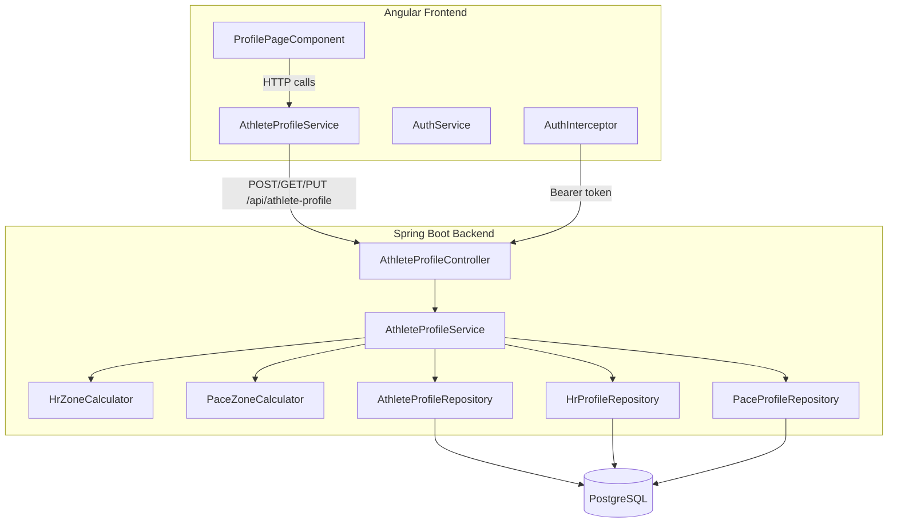

# Design Document: athlete-profile

## Overview

This feature introduces the Athlete Profile — the central data entity that stores a runner's physiological metrics, race performance data, and derived training zones. It spans two layers:

- **Backend (Spring Boot 3.5.4 / Java 21):** A REST controller under `/api/athlete-profile` providing CRUD operations for the athlete profile. The service layer owns the business logic for validation, zone calculation (HR and Pace profiles), and enforces the one-profile-per-user constraint. Data is persisted across three new tables: `athlete_profiles`, `hr_profiles`, and `pace_profiles`.
- **Frontend (Angular 21):** A standalone `ProfilePageComponent` that displays a form for creating/editing the athlete profile, shows calculated HR and Pace zones in read-only tables, and handles client-side validation with PrimeNG components.

Each authenticated user owns exactly one Athlete Profile. The profile optionally contains an HR Profile (6 heart rate zones derived from LTHR) and a Pace Profile (6 pace zones derived from Threshold Pace). Zone calculation is deterministic and happens server-side on every create/update when the relevant threshold value is present.

---

## Architecture



**Request flow:**

1. The Angular `ProfilePageComponent` calls `AthleteProfileService` which issues HTTP requests to `/api/athlete-profile`.
2. The `AuthInterceptor` attaches the JWT Bearer token.
3. Spring Security's `JwtAuthFilter` validates the token and sets the `SecurityContext`.
4. `AthleteProfileController` delegates to `AthleteProfileService` (backend bean).
5. The service validates input, persists the profile, and triggers zone calculation via `HrZoneCalculator` and `PaceZoneCalculator`.
6. The response includes the full profile with embedded HR and Pace zone data.

---

## Components and Interfaces

### Backend

#### `AthleteProfileController` — `com.trainer.profile`

```
POST /api/athlete-profile   → CreateProfileRequest  → ProfileResponse (201) | ErrorResponse (400/409)
GET  /api/athlete-profile   → (no body)             → ProfileResponse (200) | ErrorResponse (404)
PUT  /api/athlete-profile   → UpdateProfileRequest  → ProfileResponse (200) | ErrorResponse (400/404)
```

All endpoints require authentication (JWT). The authenticated user's ID is extracted from the `SecurityContext`.

#### `CreateProfileRequest` / `UpdateProfileRequest` (validated DTO)

| Field | Type | Constraints |
|-------|------|-------------|
| dateOfBirth | `LocalDate` | `@NotNull`, must result in age ≥ 13, not in the future |
| weightKg | `BigDecimal` | `@NotNull`, `@DecimalMin("20.0")`, `@DecimalMax("300.0")`, scale ≤ 1 |
| restingHR | `Integer` | `@NotNull`, `@Min(25)`, `@Max(120)` |
| maxHR | `Integer` | `@NotNull`, `@Min(100)`, `@Max(250)` |
| lthr | `Integer` | optional, `@Min(100)`, `@Max(250)` |
| thresholdPaceSecondsPerKm | `Integer` | optional, `@Min(150)`, `@Max(900)` |
| vo2Max | `BigDecimal` | optional, `@DecimalMin("20.0")`, `@DecimalMax("90.0")`, scale ≤ 1 |
| fiveKSeconds | `Integer` | optional, `@Min(1)`, `@Max(10800)` |
| tenKSeconds | `Integer` | optional, `@Min(1)`, `@Max(21600)` |
| halfMarathonSeconds | `Integer` | optional, `@Min(1)`, `@Max(43200)` |
| marathonSeconds | `Integer` | optional, `@Min(1)`, `@Max(86400)` |

Cross-field validations (custom validator or service-level):
- `maxHR > restingHR`
- `lthr > restingHR && lthr <= maxHR` (when lthr is provided)
- Race time ordering: `5K < 10K < Half < Marathon` (only between non-null adjacent pairs)

#### `ProfileResponse`

```json
{
  "id": 1,
  "dateOfBirth": "1990-05-15",
  "weightKg": 72.5,
  "restingHR": 48,
  "maxHR": 190,
  "lthr": 168,
  "thresholdPaceSecondsPerKm": 270,
  "vo2Max": 58.5,
  "fiveKSeconds": 1080,
  "tenKSeconds": 2280,
  "halfMarathonSeconds": 5100,
  "marathonSeconds": 10800,
  "hrProfile": {
    "zones": [
      { "zoneNumber": 1, "name": "Recovery", "lowerBound": 48, "upperBound": 134 },
      { "zoneNumber": 2, "name": "Aerobic Endurance", "lowerBound": 134, "upperBound": 151 },
      { "zoneNumber": 3, "name": "Aerobic Power", "lowerBound": 151, "upperBound": 159 },
      { "zoneNumber": 4, "name": "Threshold", "lowerBound": 159, "upperBound": 171 },
      { "zoneNumber": 5, "name": "Anaerobic Endurance", "lowerBound": 171, "upperBound": 178 },
      { "zoneNumber": 6, "name": "Anaerobic Power", "lowerBound": 178, "upperBound": 190 }
    ]
  },
  "paceProfile": {
    "zones": [
      { "zoneNumber": 1, "name": "Recovery", "lowerBound": 375, "upperBound": 900 },
      { "zoneNumber": 2, "name": "Aerobic Endurance", "lowerBound": 310, "upperBound": 375 },
      { "zoneNumber": 3, "name": "Aerobic Power", "lowerBound": 290, "upperBound": 310 },
      { "zoneNumber": 4, "name": "Threshold", "lowerBound": 265, "upperBound": 290 },
      { "zoneNumber": 5, "name": "Anaerobic Endurance", "lowerBound": 243, "upperBound": 265 },
      { "zoneNumber": 6, "name": "Anaerobic Power", "lowerBound": 150, "upperBound": 243 }
    ]
  }
}
```

When `hrProfile` or `paceProfile` is absent, the field is `null`.

#### `AthleteProfileService` bean — `com.trainer.profile`

- `createProfile(Long userId, CreateProfileRequest)` — validates, persists profile, triggers zone calculation if thresholds present
- `getProfile(Long userId)` — fetches profile with eager-loaded zones, returns 404 if not found
- `updateProfile(Long userId, UpdateProfileRequest)` — full replacement, recalculates/deletes zones as needed

#### `HrZoneCalculator` — `com.trainer.profile`

Pure function: `List<HrZone> calculate(int restingHR, int lthr, int maxHR)`

Zone calculation logic:
| Zone | Name | Lower Bound | Upper Bound |
|------|------|-------------|-------------|
| 1 | Recovery | restingHR | floor(LTHR × 0.80) |
| 2 | Aerobic Endurance | floor(LTHR × 0.80) | floor(LTHR × 0.90) |
| 3 | Aerobic Power | floor(LTHR × 0.91) | floor(LTHR × 0.95) |
| 4 | Threshold | floor(LTHR × 0.96) | floor(LTHR × 1.02) |
| 5 | Anaerobic Endurance | floor(LTHR × 1.03) | floor(LTHR × 1.06) |
| 6 | Anaerobic Power | ceil(LTHR × 1.06) + 1 | maxHR |

Adjacent zones share boundary values (upper of zone N = lower of zone N+1).

#### `PaceZoneCalculator` — `com.trainer.profile`

Pure function: `List<PaceZone> calculate(int thresholdPaceSecondsPerKm)`

Calculation approach:
1. Convert TP to speed: `tpSpeed = 1000.0 / thresholdPaceSecondsPerKm` (m/s)
2. Apply intensity percentages to get speed boundaries
3. Convert back to pace: `pace = round(1000.0 / speed)` (seconds/km)

Zone calculation logic:
| Zone | Name | Speed % Range | Lower Bound (faster pace) | Upper Bound (slower pace) |
|------|------|---------------|---------------------------|---------------------------|
| 1 | Recovery | < 72% | round(1000 / (tpSpeed × 0.72)) | 900 (cap) |
| 2 | Aerobic Endurance | 72%–87% | round(1000 / (tpSpeed × 0.87)) | round(1000 / (tpSpeed × 0.72)) |
| 3 | Aerobic Power | 88%–93% | round(1000 / (tpSpeed × 0.93)) | round(1000 / (tpSpeed × 0.88)) |
| 4 | Threshold | 94%–102% | round(1000 / (tpSpeed × 1.02)) | round(1000 / (tpSpeed × 0.94)) |
| 5 | Anaerobic Endurance | 103%–111% | round(1000 / (tpSpeed × 1.11)) | round(1000 / (tpSpeed × 1.03)) |
| 6 | Anaerobic Power | > 111% | 150 (cap) | round(1000 / (tpSpeed × 1.11)) |

Lower bound = faster pace (fewer seconds), upper bound = slower pace (more seconds).

#### `AthleteProfileRepository` — `com.trainer.profile`

Extends `JpaRepository<AthleteProfile, Long>`:
- `Optional<AthleteProfile> findByUserId(Long userId)`
- `boolean existsByUserId(Long userId)`

#### `HrProfileRepository` — `com.trainer.profile`

Extends `JpaRepository<HrProfile, Long>`:
- `Optional<HrProfile> findByAthleteProfileId(Long athleteProfileId)`
- `void deleteByAthleteProfileId(Long athleteProfileId)`

#### `PaceProfileRepository` — `com.trainer.profile`

Extends `JpaRepository<PaceProfile, Long>`:
- `Optional<PaceProfile> findByAthleteProfileId(Long athleteProfileId)`
- `void deleteByAthleteProfileId(Long athleteProfileId)`

#### `AthleteProfile` entity — `com.trainer.profile`

JPA entity mapped to `trainer.athlete_profiles`. Fields: `id`, `userId` (unique FK to `users.id`), `dateOfBirth`, `weightKg`, `restingHR`, `maxHR`, `lthr`, `thresholdPaceSecondsPerKm`, `vo2Max`, `fiveKSeconds`, `tenKSeconds`, `halfMarathonSeconds`, `marathonSeconds`, `createdAt`, `updatedAt`.

#### `HrProfile` entity — `com.trainer.profile`

JPA entity mapped to `trainer.hr_profiles`. Fields: `id`, `athleteProfileId` (unique FK), `createdAt`. Has a `@OneToMany` relationship to `HrZone` entities.

#### `HrZone` embeddable/entity — `com.trainer.profile`

Stored in `trainer.hr_zones` table. Fields: `id`, `hrProfileId` (FK), `zoneNumber`, `name`, `lowerBound`, `upperBound`.

#### `PaceProfile` entity — `com.trainer.profile`

JPA entity mapped to `trainer.pace_profiles`. Fields: `id`, `athleteProfileId` (unique FK), `createdAt`. Has a `@OneToMany` relationship to `PaceZone` entities.

#### `PaceZone` embeddable/entity — `com.trainer.profile`

Stored in `trainer.pace_zones` table. Fields: `id`, `paceProfileId` (FK), `zoneNumber`, `name`, `lowerBound`, `upperBound`.

---

### Frontend

#### `AthleteProfileService` — `src/app/core/profile/`

Singleton service (`providedIn: 'root'`).

| Method | Description |
|--------|-------------|
| `getProfile()` | GET `/api/athlete-profile` → `Observable<ProfileResponse>` |
| `createProfile(data)` | POST `/api/athlete-profile` → `Observable<ProfileResponse>` |
| `updateProfile(data)` | PUT `/api/athlete-profile` → `Observable<ProfileResponse>` |

#### `ProfilePageComponent` — `src/app/features/athlete-profile/`

Standalone component. Uses a reactive form with all profile fields. Handles two modes:
- **Create mode**: empty form, "Create Profile" button (when GET returns 404)
- **Edit mode**: pre-populated form, "Save Changes" button (when GET returns 200)

PrimeNG components used:
- `p-datepicker` for date of birth
- `p-inputnumber` for numeric fields (weightKg, restingHR, maxHR, lthr, race times)
- `p-inputmask` for threshold pace (MM:SS format)
- `p-button` for submit (with `[loading]` binding)
- `p-table` for HR and Pace zone display
- `p-toast` for success/error notifications
- `p-progressspinner` for loading state
- `p-message` for inline validation errors and "no zones" messages

#### Route configuration

```typescript
{
  path: 'profile',
  loadComponent: () => import('./features/athlete-profile/profile-page.component'),
  canActivate: [authGuard],
}
```

Added as a child of the authenticated route group in `app.routes.ts`.

---

## Data Models

### Database Tables (Flyway migration V2)

#### `trainer.athlete_profiles`

| Column | Type | Constraints |
|--------|------|-------------|
| id | BIGSERIAL | PRIMARY KEY |
| user_id | BIGINT | NOT NULL, UNIQUE, FK → users(id) |
| date_of_birth | DATE | NOT NULL |
| weight_kg | NUMERIC(4,1) | NOT NULL |
| resting_hr | INTEGER | NOT NULL |
| max_hr | INTEGER | NOT NULL |
| lthr | INTEGER | nullable |
| threshold_pace_seconds_per_km | INTEGER | nullable |
| vo2_max | NUMERIC(3,1) | nullable |
| five_k_seconds | INTEGER | nullable |
| ten_k_seconds | INTEGER | nullable |
| half_marathon_seconds | INTEGER | nullable |
| marathon_seconds | INTEGER | nullable |
| created_at | TIMESTAMPTZ | NOT NULL DEFAULT NOW() |
| updated_at | TIMESTAMPTZ | NOT NULL DEFAULT NOW() |

#### `trainer.hr_profiles`

| Column | Type | Constraints |
|--------|------|-------------|
| id | BIGSERIAL | PRIMARY KEY |
| athlete_profile_id | BIGINT | NOT NULL, UNIQUE, FK → athlete_profiles(id) ON DELETE CASCADE |
| created_at | TIMESTAMPTZ | NOT NULL DEFAULT NOW() |

#### `trainer.hr_zones`

| Column | Type | Constraints |
|--------|------|-------------|
| id | BIGSERIAL | PRIMARY KEY |
| hr_profile_id | BIGINT | NOT NULL, FK → hr_profiles(id) ON DELETE CASCADE |
| zone_number | INTEGER | NOT NULL |
| name | VARCHAR(50) | NOT NULL |
| lower_bound | INTEGER | NOT NULL |
| upper_bound | INTEGER | NOT NULL |

#### `trainer.pace_profiles`

| Column | Type | Constraints |
|--------|------|-------------|
| id | BIGSERIAL | PRIMARY KEY |
| athlete_profile_id | BIGINT | NOT NULL, UNIQUE, FK → athlete_profiles(id) ON DELETE CASCADE |
| created_at | TIMESTAMPTZ | NOT NULL DEFAULT NOW() |

#### `trainer.pace_zones`

| Column | Type | Constraints |
|--------|------|-------------|
| id | BIGSERIAL | PRIMARY KEY |
| pace_profile_id | BIGINT | NOT NULL, FK → pace_profiles(id) ON DELETE CASCADE |
| zone_number | INTEGER | NOT NULL |
| name | VARCHAR(50) | NOT NULL |
| lower_bound | INTEGER | NOT NULL |
| upper_bound | INTEGER | NOT NULL |

### TypeScript Interfaces — `src/app/core/profile/profile.model.ts`

```typescript
export interface ProfileRequest {
  dateOfBirth: string;          // ISO date string YYYY-MM-DD
  weightKg: number;
  restingHR: number;
  maxHR: number;
  lthr?: number | null;
  thresholdPaceSecondsPerKm?: number | null;
  vo2Max?: number | null;
  fiveKSeconds?: number | null;
  tenKSeconds?: number | null;
  halfMarathonSeconds?: number | null;
  marathonSeconds?: number | null;
}

export interface ProfileResponse {
  id: number;
  dateOfBirth: string;
  weightKg: number;
  restingHR: number;
  maxHR: number;
  lthr: number | null;
  thresholdPaceSecondsPerKm: number | null;
  vo2Max: number | null;
  fiveKSeconds: number | null;
  tenKSeconds: number | null;
  halfMarathonSeconds: number | null;
  marathonSeconds: number | null;
  hrProfile: HrProfileResponse | null;
  paceProfile: PaceProfileResponse | null;
}

export interface HrProfileResponse {
  zones: HrZoneResponse[];
}

export interface HrZoneResponse {
  zoneNumber: number;
  name: string;
  lowerBound: number;
  upperBound: number;
}

export interface PaceProfileResponse {
  zones: PaceZoneResponse[];
}

export interface PaceZoneResponse {
  zoneNumber: number;
  name: string;
  lowerBound: number;   // seconds/km (faster pace)
  upperBound: number;   // seconds/km (slower pace)
}
```

---


## Correctness Properties

*A property is a characteristic or behavior that should hold true across all valid executions of a system — essentially, a formal statement about what the system should do. Properties serve as the bridge between human-readable specifications and machine-verifiable correctness guarantees.*

This feature has strong property-based testing applicability in the zone calculation logic (pure functions), input validation (wide input space), and data round-trips. The `HrZoneCalculator` and `PaceZoneCalculator` are pure functions with clear mathematical specifications — ideal PBT targets.

---

### Property 1: Profile data round-trip

*For any* valid profile payload (dateOfBirth resulting in age ≥ 13, weightKg in [20.0, 300.0], restingHR in [25, 120], maxHR in [100, 250] with maxHR > restingHR, and optional fields within their valid ranges with race times in ascending order), creating the profile via POST and then retrieving it via GET SHALL return a response containing all submitted field values unchanged.

**Validates: Requirements 1.1, 2.1**

---

### Property 2: Invalid input rejection

*For any* profile request payload that violates exactly one validation rule (dateOfBirth in the future or age < 13, weightKg outside [20.0, 300.0], restingHR outside [25, 120], maxHR outside [100, 250], maxHR ≤ restingHR, lthr outside [100, 250] when provided, lthr ≤ restingHR or lthr > maxHR when provided, thresholdPaceSecondsPerKm outside [150, 900] when provided, or any race time ≤ 0 or exceeding its per-distance cap), the API SHALL return HTTP 400.

**Validates: Requirements 1.3, 1.4, 1.5, 1.6, 1.7, 1.8, 1.11, 1.12, 1.13, 3.4**

---

### Property 3: HR zone calculation correctness

*For any* valid triple (restingHR in [25, 120], lthr in [100, 250], maxHR in [100, 250]) where restingHR < lthr ≤ maxHR, the `HrZoneCalculator` SHALL produce exactly 6 zones where: Zone 1 has lowerBound = restingHR and upperBound = floor(lthr × 0.80), Zone 2–5 boundaries follow the specified LTHR percentage formula, and Zone 6 has lowerBound = ceil(lthr × 1.06) + 1 and upperBound = maxHR.

**Validates: Requirements 4.1, 4.2, 4.3, 4.4, 4.6**

---

### Property 4: HR zone adjacency invariant

*For any* valid (restingHR, lthr, maxHR) triple, the HR zones produced by `HrZoneCalculator` SHALL satisfy the adjacency constraint: for every pair of consecutive zones (N, N+1), the upper bound of zone N equals the lower bound of zone N+1.

**Validates: Requirements 4.5**

---

### Property 5: Pace zone calculation correctness

*For any* valid thresholdPaceSecondsPerKm in [150, 900], the `PaceZoneCalculator` SHALL produce exactly 6 zones where each zone's boundaries are calculated by converting TP to speed (1000/TP), applying the specified intensity percentages, and converting back to pace (round(1000/speed)), with Zone 1 upper bound capped at 900 and Zone 6 lower bound capped at 150.

**Validates: Requirements 5.1, 5.2, 5.3, 5.4**

---

### Property 6: Pace zone ordering invariant

*For any* valid thresholdPaceSecondsPerKm in [150, 900], every pace zone produced by `PaceZoneCalculator` SHALL have lowerBound < upperBound (lower bound is the faster pace with fewer seconds per km, upper bound is the slower pace with more seconds per km).

**Validates: Requirements 5.5**

---

### Property 7: Zone recalculation on update

*For any* existing athlete profile with an HR Profile (or Pace Profile), when the profile is updated with a different valid lthr (or thresholdPaceSecondsPerKm) value, the returned zone boundaries SHALL match the freshly calculated values for the new threshold — not the old values.

**Validates: Requirements 3.5, 3.6, 4.7, 5.6**

---

### Property 8: Race time ordering validation

*For any* pair of adjacent non-null race times (5K/10K, 10K/Half-Marathon, Half-Marathon/Marathon) where the longer distance time is less than or equal to the shorter distance time, the API SHALL return HTTP 400 with a validation error identifying the failing pair.

**Validates: Requirements 7.1, 7.2, 7.3**

---

### Property 9: Update full replacement semantics

*For any* existing athlete profile that has all optional fields populated, when a PUT request is submitted containing only the required fields (dateOfBirth, weightKg, restingHR, maxHR) with all optional fields omitted, the response SHALL show all optional fields as null.

**Validates: Requirements 3.3**

---

### Property 10: Client-side validation prevents API calls

*For any* form state where at least one required field is empty, or a numeric field is outside its valid range, or maxHR ≤ restingHR, or lthr is outside (restingHR, maxHR] when provided, submitting the profile form SHALL NOT dispatch an HTTP request to the backend and SHALL display at least one inline validation error.

**Validates: Requirements 6.5**

---

### Property 11: Pace formatting round-trip

*For any* integer value representing seconds per kilometre in [150, 900], formatting it as `MM:SS` and parsing it back SHALL produce the original integer value.

**Validates: Requirements 6.10**

---

## Error Handling

### Backend

| Scenario | HTTP Status | Response body |
|----------|-------------|---------------|
| Validation failure (field out of range, missing required field) | 400 | `{ "message": "...", "field": "<fieldName>" }` |
| Cross-field validation failure (maxHR ≤ restingHR, lthr constraint, race time ordering) | 400 | `{ "message": "...", "field": "<fieldName>" }` or `{ "message": "...", "errors": [...] }` for multiple |
| Profile already exists (duplicate creation) | 409 | `{ "message": "Athlete profile already exists" }` |
| Profile not found (GET/PUT without existing profile) | 404 | `{ "message": "Athlete profile not found" }` |
| Missing/invalid JWT | 401 | `{ "message": "Unauthorized" }` |
| Unexpected server error | 500 | `{ "message": "An unexpected error occurred" }` |

**Implementation notes:**
- Extend the existing `GlobalExceptionHandler` in `com.trainer.auth` (or create a profile-specific one) to handle `ProfileAlreadyExistsException`, `ProfileNotFoundException`, and `MethodArgumentNotValidException`.
- Cross-field validation (maxHR > restingHR, lthr constraints, race time ordering) is implemented as a custom validator or in the service layer, throwing a custom `ValidationException` with field details.
- When multiple race time pairs fail validation, all errors are collected and returned in a single 400 response.

### Frontend

| Scenario | Behaviour |
|----------|-----------|
| HTTP 404 on initial GET | Switch to creation mode (empty form) |
| HTTP 201 after create | Show success toast (auto-dismiss 5s), switch to edit mode |
| HTTP 200 after update | Show success toast (auto-dismiss 5s), refresh displayed data |
| HTTP 400 from API | Map field-level errors to inline form errors |
| HTTP 409 from API | Show error toast: "Profile already exists" |
| HTTP 401 from any endpoint | Handled by `AuthInterceptor` → logout and redirect |
| HTTP 5xx | Show error toast: "Something went wrong. Please try again." |
| Client-side validation failure | Show inline PrimeNG `p-message` errors per field, do not submit |

---

## Testing Strategy

### Backend

**Unit tests (JUnit 5 + Mockito)**
- `AthleteProfileService`: create success, duplicate profile (409), get success, get not found (404), update success, update not found, zone trigger/deletion logic
- `HrZoneCalculator`: specific examples with known LTHR values and expected zone boundaries
- `PaceZoneCalculator`: specific examples with known TP values and expected zone boundaries
- `AthleteProfileController`: request validation, response mapping, HTTP status codes
- Cross-field validation: maxHR > restingHR, lthr constraints, race time ordering

**Property-based tests (jqwik)**

jqwik is already in `pom.xml` as a test dependency. Each property test runs a minimum of 100 iterations (`@Property(tries = 100)`). Tag format in comments: `Feature: athlete-profile, Property <N>: <property_text>`.

| Property | Test class | Generator |
|----------|-----------|-----------|
| 1 — Profile data round-trip | `AthleteProfileServicePropertyTest` | `@Provide` valid profile arbitraries (DOB, weight, HR values, optional race times) |
| 2 — Invalid input rejection | `AthleteProfileValidationPropertyTest` | Arbitraries that generate one invalid field per payload |
| 3 — HR zone calculation correctness | `HrZoneCalculatorPropertyTest` | `@Provide` valid (restingHR, lthr, maxHR) triples |
| 4 — HR zone adjacency invariant | `HrZoneCalculatorPropertyTest` | Same generator as Property 3 |
| 5 — Pace zone calculation correctness | `PaceZoneCalculatorPropertyTest` | `@Provide` valid TP values in [150, 900] |
| 6 — Pace zone ordering invariant | `PaceZoneCalculatorPropertyTest` | Same generator as Property 5 |
| 7 — Zone recalculation on update | `AthleteProfileServicePropertyTest` | Generate profile + two different valid threshold values |
| 8 — Race time ordering validation | `AthleteProfileValidationPropertyTest` | Generate adjacent race time pairs where longer ≤ shorter |
| 9 — Update full replacement | `AthleteProfileServicePropertyTest` | Generate full profile, then required-only update payload |

**Integration tests (Spring Boot Test + H2)**
- Full request/response cycle for POST, GET, PUT against in-memory database
- Authentication enforcement (401 without token)
- Profile isolation (user A cannot see user B's profile)
- Zone cascade deletion when threshold removed

### Frontend

**Unit tests (Karma + Jasmine)**
- `AthleteProfileService`: HTTP method calls, URL correctness, response mapping
- `ProfilePageComponent`: form creation mode vs edit mode, field population, validation error display, loading states, success/error notifications, zone table rendering, MM:SS formatting

**Property-based tests (fast-check)**

fast-check should be added to `devDependencies` in `package.json`:
```
"fast-check": "^3.22.0"
```

Each property test runs a minimum of 100 iterations. Tag format in comments: `Feature: athlete-profile, Property <N>: <property_text>`.

| Property | Test file | Generator |
|----------|-----------|-----------|
| 10 — Client-side validation prevents API calls | `profile-page.component.spec.ts` | Generate form states with at least one invalid field |
| 11 — Pace formatting round-trip | `profile-page.component.spec.ts` | `fc.integer({ min: 150, max: 900 })` for seconds values |
