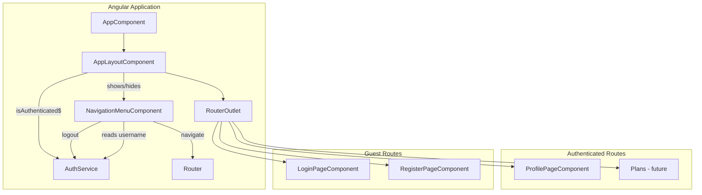

# Design Document: navigation-menu

## Overview

This feature adds a persistent left-side navigation menu to the AI Trainer application for authenticated users. It is a frontend-only feature implemented entirely in the Angular 21 application.

The implementation introduces two new standalone components:

- **`AppLayoutComponent`** — A wrapper component that conditionally renders the `NavigationMenuComponent` alongside the main content area (`<router-outlet>`). It subscribes to `AuthService.isAuthenticated$` to toggle between the authenticated layout (menu + content) and the unauthenticated layout (content only).
- **`NavigationMenuComponent`** — The navigation panel itself, displaying the app version, logged-in username, menu items (Profile, Plans placeholder), and a logout action.

The current `AppComponent` template (`<router-outlet />`) will be replaced with the `AppLayoutComponent` which owns the layout logic. Routes remain unchanged — the `AppLayoutComponent` wraps the existing `<router-outlet>` and conditionally adds the side menu.

---

## Architecture



**Layout behaviour:**

1. `AppComponent` renders `AppLayoutComponent` as its sole child.
2. `AppLayoutComponent` subscribes to `AuthService.isAuthenticated$`.
3. When authenticated: renders `NavigationMenuComponent` (fixed 72px left panel) + `<router-outlet>` (remaining width).
4. When unauthenticated: renders only `<router-outlet>` (full width).
5. `NavigationMenuComponent` reads the username from `AuthService.currentUser$` (the `sub` claim) and the app version from an injected environment value.

---

## Components and Interfaces

### `AppLayoutComponent` — `src/app/shared/layout/`

Standalone component that owns the authenticated/unauthenticated layout split.

**Template structure:**
```html
@if (isAuthenticated()) {
  <div class="app-layout">
    <app-navigation-menu />
    <main class="app-layout__content">
      <router-outlet />
    </main>
  </div>
} @else {
  <router-outlet />
}
```

**Component logic:**
- Injects `AuthService`
- Exposes `isAuthenticated` as a signal (using `toSignal` from `@angular/core/rxjs-interop` on `AuthService.isAuthenticated$`)
- No other logic — purely structural

**Styles (`app-layout.component.scss`):**
```scss
.app-layout {
  display: flex;
  height: 100vh;

  &__content {
    flex: 1;
    overflow-y: auto;
    min-width: 0;
  }
}
```

---

### `NavigationMenuComponent` — `src/app/shared/layout/`

Standalone component rendering the side navigation panel.

**Inputs/Dependencies:**
- `AuthService` — for `currentUser$` (username) and `logout()`
- `Router` — for navigation and active route detection
- `APP_VERSION` injection token — for displaying the version string

**Template structure:**
```html
<nav class="nav-menu">
  <div class="nav-menu__items">
    <a class="nav-menu__item"
       routerLink="/profile"
       routerLinkActive="nav-menu__item--active">
      <i class="pi pi-user"></i>
      <span>Profile</span>
    </a>

    <div class="nav-menu__item nav-menu__item--disabled">
      <i class="pi pi-calendar"></i>
      <span>Plans</span>
    </div>
  </div>

  <div class="nav-menu__spacer"></div>

  <div class="nav-menu__footer">
    <button class="nav-menu__item nav-menu__logout" (click)="logout()">
      <i class="pi pi-sign-out"></i>
      <span>Logout</span>
    </button>

    <div class="nav-menu__info">
      <span class="nav-menu__username">{{ username() }}</span>
      <span class="nav-menu__version">v{{ appVersion }}</span>
    </div>
  </div>
</nav>
```

**Component logic:**
- `username` — signal derived from `AuthService.currentUser$`, maps to `user?.sub ?? ''`
- `appVersion` — injected via `APP_VERSION` token
- `logout()` — calls `AuthService.logout()`

**Styles (`navigation-menu.component.scss`):**
```scss
.nav-menu {
  display: flex;
  flex-direction: column;
  width: 72px;
  height: 100vh;
  position: sticky;
  top: 0;
  background: var(--surface-card);
  border-right: 1px solid var(--surface-border);
  padding: 0.5rem 0;

  &__items {
    display: flex;
    flex-direction: column;
    gap: 0.25rem;
  }

  &__item {
    display: flex;
    flex-direction: column;
    align-items: center;
    justify-content: center;
    gap: 0.25rem;
    padding: 0.75rem 0.25rem;
    text-decoration: none;
    color: var(--text-color);
    font-size: 0.625rem;
    cursor: pointer;
    border: none;
    background: none;
    width: 100%;
    transition: background-color 0.2s;

    &:hover {
      background: var(--surface-hover);
    }

    &--active {
      color: var(--primary-color);
      background: var(--highlight-bg);
    }

    &--disabled {
      opacity: 0.4;
      cursor: default;
      pointer-events: none;
    }

    i {
      font-size: 1.25rem;
    }
  }

  &__spacer {
    flex: 1;
  }

  &__footer {
    display: flex;
    flex-direction: column;
    align-items: center;
    gap: 0.5rem;
    padding: 0.5rem 0.25rem;
    border-top: 1px solid var(--surface-border);
  }

  &__logout {
    color: var(--text-color-secondary);
  }

  &__info {
    display: flex;
    flex-direction: column;
    align-items: center;
    gap: 0.125rem;
    font-size: 0.5625rem;
    color: var(--text-color-secondary);
  }

  &__username {
    max-width: 60px;
    overflow: hidden;
    text-overflow: ellipsis;
    white-space: nowrap;
  }

  &__version {
    opacity: 0.7;
  }
}
```

---

### `APP_VERSION` Injection Token — `src/app/core/`

```typescript
// src/app/core/app-version.token.ts
import { InjectionToken } from '@angular/core';

export const APP_VERSION = new InjectionToken<string>('APP_VERSION');
```

Provided in `app.config.ts`:
```typescript
import { APP_VERSION } from './core/app-version.token';
import packageJson from '../../package.json';

// In providers array:
{ provide: APP_VERSION, useValue: packageJson.version }
```

This requires enabling `resolveJsonModule: true` in `tsconfig.json` (already the default in Angular 21).

---

### Changes to Existing Components

#### `AppComponent` (`src/app/app.component.ts`)

The template changes from `<router-outlet />` to rendering `AppLayoutComponent`:

```html
<app-layout />
```

The component imports `AppLayoutComponent` instead of `RouterOutlet`.

#### `app.routes.ts`

No route changes needed. The existing route configuration already:
- Redirects `/` → `/profile` (satisfying Requirement 3.4 — default landing page)
- Protects `/profile` with `authGuard`
- Redirects `**` → `/profile`

---

## Data Models

This feature introduces no new data models or API endpoints. All data is sourced from existing client-side state:

| Data | Source | Type |
|------|--------|------|
| Authentication state | `AuthService.isAuthenticated$` | `Observable<boolean>` |
| Username | `AuthService.currentUser$` → `DecodedToken.sub` | `string \| null` |
| App version | `package.json` → `version` field | `string` |
| Active route | Angular `RouterLinkActive` directive | CSS class binding |

### Menu Item Model (internal)

```typescript
interface MenuItem {
  label: string;
  icon: string;           // PrimeNG icon class (e.g. 'pi-user')
  routerLink?: string;    // Navigation target (absent for disabled items)
  disabled?: boolean;     // Renders as non-interactive
}
```

Static configuration within `NavigationMenuComponent`:
```typescript
readonly menuItems: MenuItem[] = [
  { label: 'Profile', icon: 'pi-user', routerLink: '/profile' },
  { label: 'Plans', icon: 'pi-calendar', disabled: true },
];
```

---

## Error Handling

This feature has minimal error scenarios since it relies on existing services and client-side state:

| Scenario | Behaviour |
|----------|-----------|
| JWT `sub` claim cannot be extracted (malformed token) | `AuthService.currentUser$` emits `null` → username displays as empty string |
| Token expires during session | `AuthService.initFromStorage()` clears state → `isAuthenticated$` emits `false` → menu hides, user redirected to login on next navigation |
| `AuthService.logout()` throws | Unlikely (synchronous localStorage removal + navigation), but if navigation fails, user remains on current page with cleared auth state |
| `package.json` version field missing | Build-time error — `APP_VERSION` token would be `undefined`, displayed as empty. Prevented by TypeScript type checking. |

---

## Testing Strategy

### PBT Applicability Assessment

Property-based testing is **NOT applicable** for this feature because:

1. **UI rendering and layout** — The navigation menu is a presentational component. Its correctness is about DOM structure, CSS positioning, and visual state — not about transforming data across a wide input space.
2. **No pure functions with meaningful input variation** — The username comes directly from `AuthService.currentUser$` (already tested). The version is a static string. Menu items are a static array.
3. **Routing and navigation** — These are Angular framework behaviours tested via example-based integration tests, not property generators.
4. **No data transformations** — There are no serializers, parsers, calculators, or algorithms in this feature.

The appropriate testing strategy is **example-based unit tests** covering specific scenarios and **integration tests** for routing behaviour.

---

### Unit Tests (Karma + Jasmine)

#### `AppLayoutComponent` tests

| Test case | Validates |
|-----------|-----------|
| Renders `NavigationMenuComponent` when `isAuthenticated$` emits `true` | Req 1.1 |
| Does NOT render `NavigationMenuComponent` when `isAuthenticated$` emits `false` | Req 1.2 |
| Hides menu when auth state changes from `true` to `false` | Req 1.4 |
| Always renders `<router-outlet>` regardless of auth state | Req 1.1, 1.2 |
| Menu persists across route changes (component not destroyed) | Req 1.3 |
| Layout uses flexbox with menu at 72px and content filling remaining space | Req 6.1, 6.3 |

#### `NavigationMenuComponent` tests

| Test case | Validates |
|-----------|-----------|
| Displays app version text from `APP_VERSION` token | Req 2.1 |
| Displays username from `AuthService.currentUser$` | Req 2.2 |
| Displays empty string when `currentUser$` emits `null` | Req 2.4 |
| Username has `text-overflow: ellipsis` styling | Req 2.2 |
| Updates username when `currentUser$` emits new value | Req 2.3 |
| Renders profile menu item with `pi-user` icon and "Profile" label | Req 3.1 |
| Profile item has `routerLink="/profile"` | Req 3.2 |
| Profile item receives active class when on `/profile` route | Req 3.3 |
| Renders "Plans" menu item with icon and "Plans" label | Req 4.1, 4.2 |
| Plans item has disabled styling (reduced opacity) | Req 4.3 |
| Plans item is non-interactive (no click handler, `pointer-events: none`) | Req 4.4 |
| Plans item is positioned between Profile and Logout | Req 4.5 |
| Renders logout icon (`pi-sign-out`) at bottom, separated from menu items | Req 5.1 |
| Clicking logout calls `AuthService.logout()` | Req 5.2 |
| No confirmation dialog on logout click | Req 5.2 |
| Menu has fixed width of 72px | Req 6.2 |
| Menu height is 100vh (full viewport height) | Req 6.2 |

#### Integration-style tests

| Test case | Validates |
|-----------|-----------|
| After `AuthService.logout()`, user is navigated to `/auth/login` | Req 5.3 |
| After logout, navigating to `/profile` redirects to `/auth/login` | Req 5.4 |
| Default route `/` redirects to `/profile` for authenticated users | Req 3.4 |

---

### Test Setup Notes

- Mock `AuthService` using a `BehaviorSubject` to control `isAuthenticated$` and `currentUser$` emissions
- Provide `APP_VERSION` token with a test value (e.g. `'1.2.3'`)
- Use `RouterTestingModule` (or `provideRouter` with test routes) for route-related tests
- Use `By.css()` queries to verify DOM structure and CSS classes
- No additional test dependencies needed — Karma + Jasmine is sufficient for this feature
