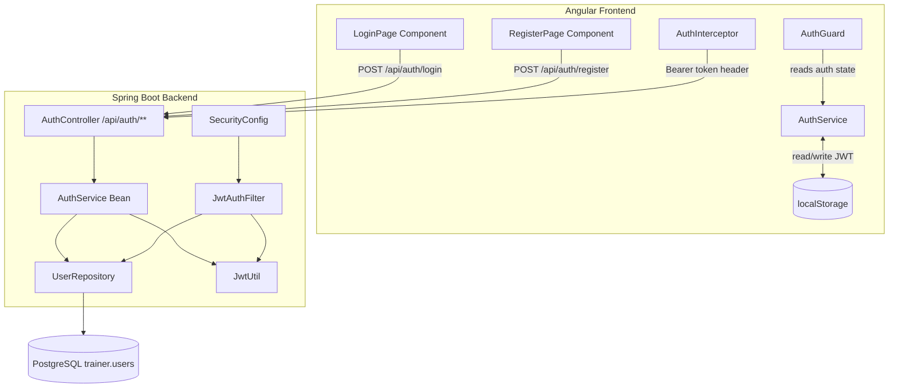

# Design Document: user-auth

## Overview

This feature adds end-to-end user authentication to the AI Trainer application. It spans two layers:

- **Backend (Spring Boot 3.5.4 / Java 21):** Stateless REST endpoints under `/api/auth/**` that handle registration, login, and JWT validation. Spring Security enforces authentication on all other routes. Passwords are BCrypt-hashed; tokens are signed JWTs with a 24-hour expiry.
- **Frontend (Angular 21):** Standalone components for login and registration, a core `AuthService` that owns token lifecycle, a DI-based HTTP interceptor that attaches the Bearer token to every outgoing request, and a route guard that redirects unauthenticated users.

The existing `trainer.users` table (managed by Flyway) is the sole persistence target. No new tables are required.

---

## Architecture



**Request flow for a protected endpoint:**

1. Angular `AuthInterceptor` reads the JWT from `localStorage` and adds `Authorization: Bearer <token>`.
2. Spring Security's filter chain runs `JwtAuthFilter` before the controller.
3. `JwtAuthFilter` validates the token (signature, expiry, enabled user) and sets the `SecurityContext`.
4. The controller proceeds; if any check fails, a 401 is returned before the controller is reached.

---

## Components and Interfaces

### Backend

#### `AuthController` — `com.trainer.auth`

```
POST /api/auth/register  → RegisterRequest  → RegisterResponse (201) | ErrorResponse (400/409)
POST /api/auth/login     → LoginRequest     → LoginResponse (200)    | ErrorResponse (400/401)
```

#### `RegisterRequest` (validated DTO)

| Field    | Constraints |
|----------|-------------|
| username | `@NotBlank`, `@Size(min=3, max=100)`, `@Pattern([a-zA-Z0-9_-]+)` |
| email    | `@NotBlank`, `@Email` |
| password | `@NotBlank`, `@Size(min=8, max=255)` |

#### `LoginRequest` (validated DTO)

| Field    | Constraints |
|----------|-------------|
| username | `@NotBlank` |
| password | `@NotBlank` |

#### `RegisterResponse`

```json
{ "id": 1, "username": "alice" }
```

#### `LoginResponse`

```json
{ "token": "<signed-jwt>" }
```

#### `ErrorResponse`

```json
{ "message": "Username already taken", "field": "username" }
```

#### `AuthService` bean — `com.trainer.auth`

- `register(RegisterRequest)` — validates uniqueness, BCrypt-hashes password, persists user, returns `RegisterResponse`
- `login(LoginRequest)` — loads user, verifies BCrypt match, checks `enabled`, issues JWT

#### `JwtUtil` — `com.trainer.auth`

- `generateToken(String username)` — signs a JWT with `sub=username`, `iat=now`, `exp=now+24h`
- `extractUsername(String token)` — parses and returns the `sub` claim
- `isTokenValid(String token, UserDetails userDetails)` — checks signature, expiry, and username match

#### `JwtAuthFilter` — `com.trainer.auth`

Extends `OncePerRequestFilter`. Reads the `Authorization` header, delegates to `JwtUtil`, loads `UserDetails` from `UserDetailsService`, and calls `SecurityContextHolder.getContext().setAuthentication(...)`.

#### `UserRepository` — `com.trainer.auth`

Extends `JpaRepository<User, Long>`:
- `Optional<User> findByUsername(String username)`
- `boolean existsByUsername(String username)`
- `boolean existsByEmail(String email)`

#### `User` entity — `com.trainer.auth`

JPA entity mapped to `trainer.users`. Implements `UserDetails`. Fields: `id`, `username`, `email`, `password`, `enabled`, `createdAt`, `updatedAt`.

#### `SecurityConfig` update — `com.trainer.config`

- Inject `JwtAuthFilter` and add it before `UsernamePasswordAuthenticationFilter`
- Expose `AuthenticationManager` bean
- Wire `UserDetailsService` implementation

---

### Frontend

#### `AuthService` — `src/app/core/auth/`

Singleton service (`providedIn: 'root'`).

| Member | Description |
|--------|-------------|
| `currentUser$` | `BehaviorSubject<DecodedToken \| null>` — emits the decoded JWT payload or null |
| `isAuthenticated$` | `Observable<boolean>` derived from `currentUser$` |
| `login(credentials)` | POST to `/api/auth/login`, stores token, decodes and emits user |
| `register(data)` | POST to `/api/auth/register` |
| `logout()` | Clears token from `localStorage`, emits null, navigates to `/auth/login` |
| `initFromStorage()` | Called at app init via `APP_INITIALIZER`; restores state if token is valid |
| `getToken()` | Returns raw JWT string from `localStorage` or null |

#### `AuthInterceptor` — `src/app/core/auth/`

DI-based `HttpInterceptorFn`. Reads the token from `AuthService.getToken()`, clones the request with `Authorization: Bearer <token>` if present. On HTTP 401 response, calls `AuthService.logout()`.

#### `AuthGuard` — `src/app/core/auth/`

Functional route guard (`CanActivateFn`). Reads `AuthService.isAuthenticated$`:
- Unauthenticated on a protected route → redirect to `/auth/login?redirectTo=<url>`
- Authenticated on `/auth/login` or `/auth/register` → redirect to `/`
- Expired/missing token → clears token, treats as unauthenticated

#### `LoginPageComponent` — `src/app/features/auth/login/`

Standalone component. Reactive form with `username` and `password` controls. Handles 401 vs other errors distinctly. Disables submit and shows spinner while request is in-flight.

PrimeNG components used: `p-inputtext` for the username field, `p-password` for the masked password field, `p-button` for the submit button (with `[loading]` binding for in-flight state), `p-message` for inline error display.

#### `RegisterPageComponent` — `src/app/features/auth/register/`

Standalone component. Reactive form with `username`, `email`, `password`, `confirmPassword` controls. Cross-field validator for password match. Maps 409 response body to field-level errors.

PrimeNG components used: `p-inputtext` for username and email fields, `p-password` for both password fields (with `[feedback]="false"` on confirm-password), `p-button` for the submit button (with `[loading]` binding), `p-message` for inline and form-level error display.

#### Route configuration (`app.routes.ts`)

```typescript
{
  path: 'auth',
  children: [
    { path: 'login',    loadComponent: () => import('./features/auth/login/login-page.component') },
    { path: 'register', loadComponent: () => import('./features/auth/register/register-page.component') },
  ]
},
{
  path: '',
  canActivate: [AuthGuard],
  // protected feature routes nested here
}
```

---

## Data Models

### JWT Payload

```json
{
  "sub": "alice",
  "iat": 1700000000,
  "exp": 1700086400
}
```

The token is signed with HMAC-SHA256 using a secret key configured via `app.jwt.secret` in `application.yml`. The expiry is always `iat + 86400` seconds (24 hours).

### `DecodedToken` (TypeScript interface)

```typescript
interface DecodedToken {
  sub: string;   // username
  iat: number;   // issued-at (Unix seconds)
  exp: number;   // expiry (Unix seconds)
}
```

The frontend decodes the JWT payload locally (base64 decode of the middle segment) to read `sub` and `exp` — no signature verification on the client side.

### `trainer.users` table (existing — no migration needed)

| Column     | Type           | Notes |
|------------|----------------|-------|
| id         | BIGSERIAL PK   | |
| username   | VARCHAR(100)   | UNIQUE NOT NULL |
| email      | VARCHAR(255)   | UNIQUE NOT NULL |
| password   | VARCHAR(255)   | BCrypt hash |
| enabled    | BOOLEAN        | DEFAULT TRUE |
| created_at | TIMESTAMPTZ    | DEFAULT NOW() |
| updated_at | TIMESTAMPTZ    | DEFAULT NOW() |

### Backend DTOs / Response shapes

```
RegisterRequest  { username, email, password }
LoginRequest     { username, password }
RegisterResponse { id, username }
LoginResponse    { token }
ErrorResponse    { message, field? }
```

---

## Correctness Properties

*A property is a characteristic or behavior that should hold true across all valid executions of a system — essentially, a formal statement about what the system should do. Properties serve as the bridge between human-readable specifications and machine-verifiable correctness guarantees.*

This feature has testable properties in both the backend (pure service/utility logic) and the frontend (AuthService, AuthInterceptor, AuthGuard, and form validation logic). Property-based testing is applied to the logic layer; infrastructure wiring and UI rendering use example-based tests.

---

### Property 1: Valid registration round-trip

*For any* valid registration payload (username matching `[a-zA-Z0-9_-]{3,100}`, a well-formed email, and a password of 8–255 characters), submitting a POST to `/api/auth/register` SHALL return HTTP 201 with a response body containing the submitted username, and the persisted user record SHALL have `enabled = true`.

**Validates: Requirements 1.1, 1.8**

---

### Property 2: Invalid username is rejected

*For any* registration request where the username is shorter than 3 characters, longer than 100 characters, or contains characters outside `[a-zA-Z0-9_-]`, the Auth_API SHALL return HTTP 400.

**Validates: Requirements 1.4, 1.5**

---

### Property 3: Invalid password is rejected

*For any* registration request where the password is shorter than 8 characters or longer than 255 characters, the Auth_API SHALL return HTTP 400.

**Validates: Requirements 1.4, 1.6**

---

### Property 4: Invalid email is rejected

*For any* registration request where the email string does not satisfy the format rule (exactly one `@`, non-empty local part, domain with at least one `.`), the Auth_API SHALL return HTTP 400.

**Validates: Requirements 1.4, 1.7**

---

### Property 5: Login issues a correctly-formed JWT

*For any* registered, enabled user, submitting a POST to `/api/auth/login` with the correct password SHALL return HTTP 200 with a JWT whose `sub` claim equals the user's username and whose `exp` claim equals `iat + 86400` (exactly 24 hours).

**Validates: Requirements 2.1, 2.5**

---

### Property 6: Blank login fields are rejected

*For any* login request where the username or password field is blank or composed entirely of whitespace, the Auth_API SHALL return HTTP 400.

**Validates: Requirements 2.4**

---

### Property 7: Valid token grants access to protected endpoints

*For any* registered, enabled user who has obtained a valid (non-expired, correctly-signed) JWT, an HTTP request to any protected endpoint carrying that token as `Authorization: Bearer <token>` SHALL be permitted (not return HTTP 401).

**Validates: Requirements 3.1**

---

### Property 8: Successful login stores the token

*For any* JWT string returned by a successful login response, the `AuthService.login()` call SHALL result in that exact token string being present in `localStorage` under the auth token key.

**Validates: Requirements 4.1**

---

### Property 9: App initialisation restores authenticated state from a valid token

*For any* non-expired, well-formed JWT present in `localStorage` at application initialisation, `AuthService.initFromStorage()` SHALL set `isAuthenticated$` to `true` and emit a `DecodedToken` whose `sub` matches the token's `sub` claim.

**Validates: Requirements 4.2**

---

### Property 10: App initialisation clears state for absent or expired tokens

*For any* expired JWT (or absent token) in `localStorage` at application initialisation, `AuthService.initFromStorage()` SHALL set `isAuthenticated$` to `false` and emit `null` from `currentUser$`.

**Validates: Requirements 4.3**

---

### Property 11: HTTP interceptor attaches Bearer token to every request

*For any* token string present in `localStorage`, every outgoing HTTP request processed by `AuthInterceptor` SHALL carry an `Authorization` header with the value `Bearer <token>`.

**Validates: Requirements 4.4**

---

### Property 12: Logout clears all authentication state

*For any* authenticated state (token present in `localStorage`, `isAuthenticated$` emitting `true`), calling `AuthService.logout()` SHALL result in `localStorage` containing no auth token and `isAuthenticated$` emitting `false`.

**Validates: Requirements 4.5**

---

### Property 13: Auth guard redirects unauthenticated users with original URL preserved

*For any* protected route path, when no valid token is present in `localStorage`, the `AuthGuard` SHALL redirect to `/auth/login` and include the original path as the `redirectTo` query parameter.

**Validates: Requirements 5.1**

---

### Property 14: Login form blank-field validation prevents API calls

*For any* combination of blank (empty or whitespace-only) username and/or password in the login form, submitting the form SHALL display an inline validation error for each blank field and SHALL NOT dispatch an HTTP request to the Auth_API.

**Validates: Requirements 6.2**

---

### Property 15: Registration form blank-field validation prevents API calls

*For any* combination of blank required fields (username, email, password, confirmPassword) in the registration form, submitting the form SHALL display an inline validation error for each blank field and SHALL NOT dispatch an HTTP request to the Auth_API.

**Validates: Requirements 7.2**

---

### Property 16: Password mismatch validation prevents API calls

*For any* two distinct non-empty strings entered into the password and confirm-password fields, submitting the registration form SHALL display a cross-field validation error on the confirm-password field and SHALL NOT dispatch an HTTP request to the Auth_API.

**Validates: Requirements 7.3**

---

## Error Handling

### Backend

| Scenario | HTTP Status | Response body |
|----------|-------------|---------------|
| Validation failure (blank/invalid field) | 400 | `{ "message": "...", "field": "<fieldName>" }` |
| Username already taken | 409 | `{ "message": "Username already taken", "field": "username" }` |
| Email already taken | 409 | `{ "message": "Email already taken", "field": "email" }` |
| Invalid credentials or disabled user | 401 | `{ "message": "Invalid credentials" }` |
| Missing/malformed/expired/unknown-key JWT | 401 | `{ "message": "Unauthorized" }` |
| Unexpected server error | 500 | `{ "message": "An unexpected error occurred" }` — no stack traces exposed |

**Implementation notes:**
- A `@RestControllerAdvice` (`GlobalExceptionHandler`) handles `MethodArgumentNotValidException` (Bean Validation failures), `UsernameNotFoundException`, `BadCredentialsException`, and `DataIntegrityViolationException` (duplicate key).
- `JwtAuthFilter` catches all JWT exceptions (`JwtException`, `IllegalArgumentException`) and writes a 401 response directly, before the request reaches the controller.
- Error responses never include stack traces, internal class names, or SQL details.

### Frontend

| Scenario | Behaviour |
|----------|-----------|
| HTTP 401 from login | Show "Invalid username or password." inline error |
| HTTP 4xx/5xx (non-401) from login | Show "Something went wrong. Please try again." — no server details |
| HTTP 409 from register (username) | Show "Username is already taken." on the username field |
| HTTP 409 from register (email) | Show "Email is already in use." on the email field |
| HTTP 400 from register | Display the `message` field from the API response |
| HTTP 401 from any protected endpoint | `AuthInterceptor` triggers logout and redirects to `/auth/login` |
| Error messages | Cleared when the user resubmits the form |

---

## Testing Strategy

### Backend

**Unit tests (JUnit 5 + Mockito)**
- `JwtUtil`: token generation, claim extraction, expiry detection, invalid-signature detection
- `AuthService` bean: registration success, duplicate username/email, login success, wrong password, disabled user
- `GlobalExceptionHandler`: correct HTTP status and body for each exception type

**Property-based tests (jqwik)**

jqwik is the recommended PBT library for Java/JUnit 5. Add to `pom.xml`:
```xml
<dependency>
    <groupId>net.jqwik</groupId>
    <artifactId>jqwik</artifactId>
    <version>1.9.3</version>
    <scope>test</scope>
</dependency>
```

Each property test runs a minimum of 100 iterations (`@Property(tries = 100)`). Tag format in comments: `Feature: user-auth, Property <N>: <property_text>`.

| Property | Test class | Generator |
|----------|-----------|-----------|
| 1 — Valid registration round-trip | `AuthServicePropertyTest` | `@Provide` valid username/email/password arbitraries |
| 2 — Invalid username rejected | `AuthControllerPropertyTest` | Arbitraries for too-short, too-long, bad-char usernames |
| 3 — Invalid password rejected | `AuthControllerPropertyTest` | Arbitraries for passwords outside [8, 255] |
| 4 — Invalid email rejected | `AuthControllerPropertyTest` | Arbitraries for malformed email strings |
| 5 — Login issues correctly-formed JWT | `JwtUtilPropertyTest` | `@Provide` valid username strings |
| 6 — Blank login fields rejected | `AuthControllerPropertyTest` | Arbitraries for blank/whitespace strings |
| 7 — Valid token grants access | `JwtAuthFilterPropertyTest` | Generate users + tokens via `JwtUtil`; mock `UserDetailsService` |

**Integration tests (Spring Boot Test + Testcontainers)**
- Full request/response cycle for registration and login against a real PostgreSQL container
- JWT filter integration: valid token, expired token, wrong-key token, missing header
- Public endpoint accessibility (Requirements 3.5)

### Frontend

**Unit tests (Karma + Jasmine)**

- `AuthService`: login stores token, logout clears state, initFromStorage restores/clears state, getToken returns correct value
- `AuthInterceptor`: attaches header when token present, triggers logout on 401
- `AuthGuard`: redirects unauthenticated users with redirectTo param, redirects authenticated users away from auth routes
- `LoginPageComponent`: form validation errors, 401 error display, generic error display, loading state, success navigation
- `RegisterPageComponent`: form validation errors, password mismatch, 409 field errors, 400 error display, loading state, success navigation

**Property-based tests (fast-check)**

fast-check is the recommended PBT library for TypeScript. Add to `package.json`:
```
"fast-check": "3.22.0"  (devDependencies)
```

Each property test runs a minimum of 100 iterations (fast-check default). Tag format in comments: `Feature: user-auth, Property <N>: <property_text>`.

| Property | Test file | Generator |
|----------|-----------|-----------|
| 8 — Login stores token | `auth.service.spec.ts` | `fc.string()` for token values |
| 9 — Init restores state from valid token | `auth.service.spec.ts` | Generate valid JWT payloads, encode as base64 |
| 10 — Init clears state for expired/absent token | `auth.service.spec.ts` | Generate expired JWT payloads or empty string |
| 11 — Interceptor attaches Bearer header | `auth.interceptor.spec.ts` | `fc.string()` for token values |
| 12 — Logout clears state | `auth.service.spec.ts` | `fc.string()` for initial token values |
| 13 — Guard redirects with redirectTo | `auth.guard.spec.ts` | `fc.webPath()` for route paths |
| 14 — Login form blank validation | `login-page.component.spec.ts` | `fc.constantFrom('', ' ', '   ')` for blank inputs |
| 15 — Register form blank validation | `register-page.component.spec.ts` | `fc.constantFrom('', ' ', '   ')` for blank inputs |
| 16 — Password mismatch validation | `register-page.component.spec.ts` | `fc.tuple(fc.string(), fc.string()).filter(([a,b]) => a !== b)` |
