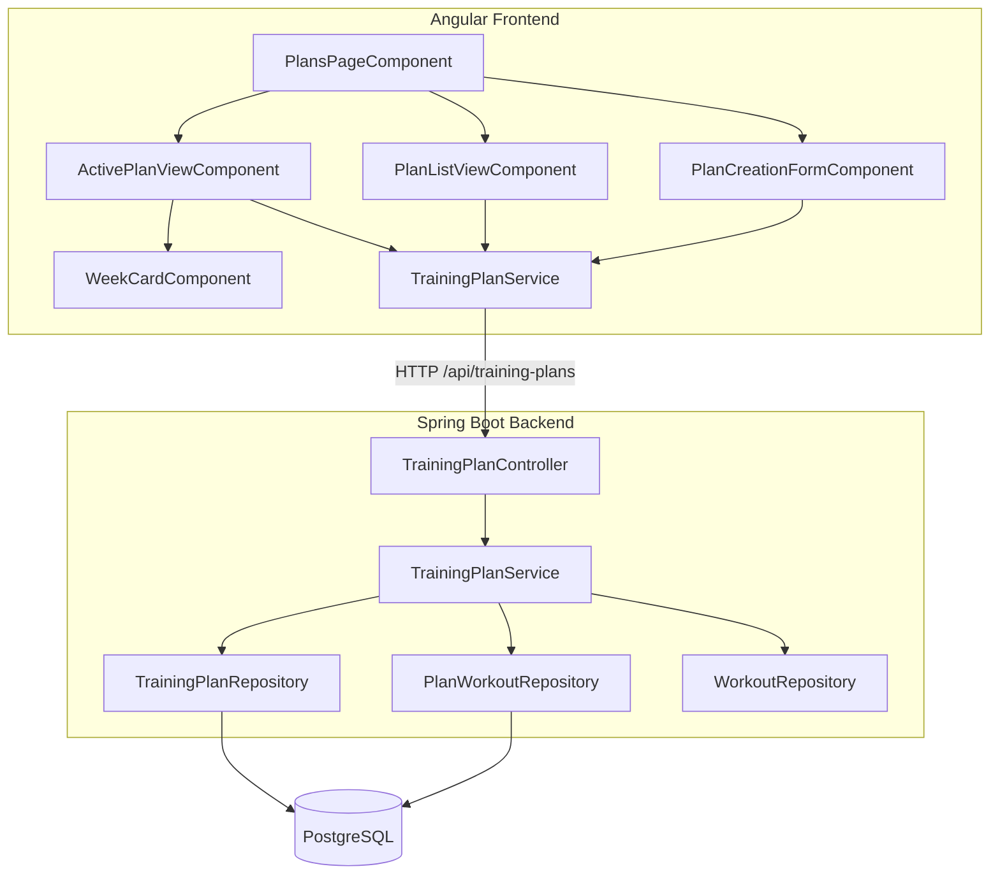
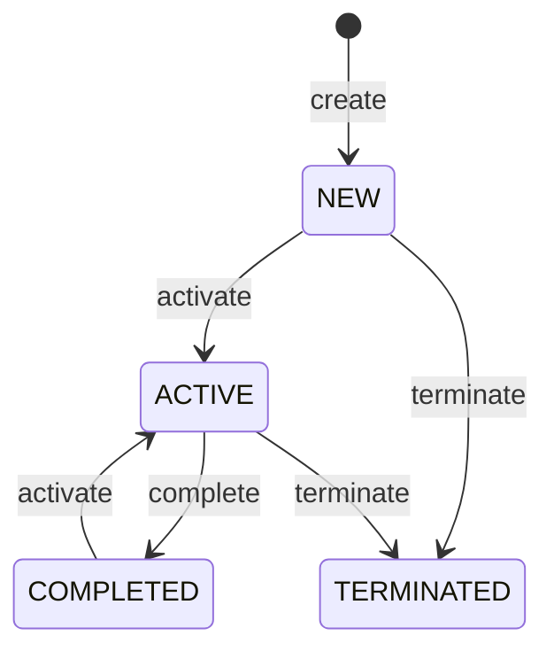

# Design Document: training-plan

## Overview

This feature adds Training Plans to the AI Trainer application — structured multi-week running programmes that organise existing Workouts into a day-by-day schedule. The feature spans both backend and frontend:

- **Backend (Spring Boot 3.5.4 / Java 21):** REST API under `/api/training-plans` for CRUD operations and state lifecycle management (NEW → ACTIVE → COMPLETED/TERMINATED). A `Plan_Workout` join entity links plans to workouts with week/day/order scheduling metadata. A single-active-plan constraint ensures only one plan is ACTIVE per user at any time, enforced transactionally.
- **Frontend (Angular 21):** A Plans page with two tabs — an Active Plan view showing week-by-week expandable cards, and a Plan List view for managing non-active plans. A creation dialog collects race details and AI model preference.

Key design decisions:
- **State machine with transactional guarantees**: Activating a plan terminates the current active plan atomically within a single transaction, preventing inconsistent states.
- **UUID identifiers**: Both `TrainingPlan` and `PlanWorkout` use UUIDs for globally unique, client-friendly identifiers.
- **Ownership isolation**: Users can only access their own plans; attempts to access another user's plan return 404 (not 403) to avoid leaking existence information.
- **Cascading deletes on plan removal**: Deleting a plan cascades to `PlanWorkout` records but leaves referenced `Workout` entities intact (ON DELETE RESTRICT on `workout_id`).
- **Scheduling immutability after NEW state**: Workout assignments can only be modified while the plan is in NEW state, ensuring the schedule is frozen once training begins.
- **Accordion-style week cards**: Only one week card is expanded at a time in the active plan view, keeping the UI focused and scannable.

---

## Architecture



**Request flow:**

1. An authenticated HTTP client sends a request to `/api/training-plans/**`.
2. Spring Security's `JwtAuthFilter` validates the JWT and sets the `SecurityContext`.
3. `TrainingPlanController` extracts the authenticated `User` via `@AuthenticationPrincipal` and delegates to `TrainingPlanService`.
4. For state transitions, the service enforces the state machine rules within a `@Transactional` boundary.
5. For retrieval with workouts, the service loads `PlanWorkout` associations eagerly and groups them by week.
6. The response DTO is constructed and returned with the appropriate HTTP status.

---

## Components and Interfaces

### Backend

#### `TrainingPlanController` — `com.trainer.trainingplan`

```
POST   /api/training-plans                → CreateTrainingPlanRequest → TrainingPlanResponse (201) | ErrorResponse (400)
GET    /api/training-plans                → (no body)                 → List<TrainingPlanSummaryResponse> (200)
GET    /api/training-plans/{id}           → (no body)                 → TrainingPlanDetailResponse (200) | ErrorResponse (404)
GET    /api/training-plans/active         → (no body)                 → TrainingPlanDetailResponse (200) | ErrorResponse (404)
PUT    /api/training-plans/{id}/activate  → (no body)                 → TrainingPlanResponse (200) | ErrorResponse (400/404)
PUT    /api/training-plans/{id}/complete  → (no body)                 → TrainingPlanResponse (200) | ErrorResponse (400/404)
PUT    /api/training-plans/{id}/terminate → (no body)                 → TrainingPlanResponse (200) | ErrorResponse (400/404)
DELETE /api/training-plans/{id}           → (no body)                 → (204) | ErrorResponse (400/404)
```

All endpoints require authentication (JWT). The authenticated user's ID is extracted from the `SecurityContext`.

#### `CreateTrainingPlanRequest` (validated DTO)

| Field | Type | Constraints |
|-------|------|-------------|
| eventName | `String` | `@NotBlank`, `@Size(max = 100)` |
| distance | `String` | `@NotNull`, must match `PlanDistance` enum |
| duration | `String` | `@NotNull`, must match `PlanDuration` enum |
| raceDate | `LocalDate` | `@NotNull`, `@Future` |
| targetPaceSecondsPerKm | `Integer` | `@NotNull`, `@Min(150)`, `@Max(900)` |
| aiModel | `String` | `@NotNull`, must match `AiModel` enum |
| trainingDays | `List<Integer>` | `@NotEmpty`, each value `@Min(1)` `@Max(7)`, no duplicates (custom validator) |
| longRunDay | `Integer` | `@NotNull`, `@Min(1)`, `@Max(7)`, must be in `trainingDays` (custom validator) |

#### `TrainingPlanResponse` (metadata only — used for create, state transitions)

```json
{
  "id": "a1b2c3d4-...",
  "eventName": "London Marathon 2025",
  "distance": "MARATHON",
  "duration": "WEEKS_12",
  "raceDate": "2025-04-13",
  "targetPaceSecondsPerKm": 300,
  "aiModel": "CLAUDE",
  "trainingDays": [1, 3, 5, 7],
  "longRunDay": 7,
  "state": "NEW",
  "createdAt": "2024-12-01T10:30:00Z",
  "updatedAt": "2024-12-01T10:30:00Z"
}
```

#### `TrainingPlanSummaryResponse` (list endpoint — same as above)

Same shape as `TrainingPlanResponse`. Used in the list endpoint to return all plans without workout details. Includes `trainingDays` and `longRunDay` fields.

#### `TrainingPlanDetailResponse` (get by id, get active — includes workouts)

```json
{
  "id": "a1b2c3d4-...",
  "eventName": "London Marathon 2025",
  "distance": "MARATHON",
  "duration": "WEEKS_12",
  "raceDate": "2025-04-13",
  "targetPaceSecondsPerKm": 300,
  "aiModel": "CLAUDE",
  "trainingDays": [1, 3, 5, 7],
  "longRunDay": 7,
  "state": "ACTIVE",
  "createdAt": "2024-12-01T10:30:00Z",
  "updatedAt": "2024-12-01T10:30:00Z",
  "weeks": [
    {
      "weekNumber": 1,
      "workouts": [
        {
          "dayOfWeek": 1,
          "orderInDay": 1,
          "workout": {
            "id": "w1-uuid-...",
            "name": "Easy Run",
            "sportType": "RUNNING",
            "subSport": null,
            "numValidSteps": 3
          }
        },
        {
          "dayOfWeek": 3,
          "orderInDay": 1,
          "workout": {
            "id": "w2-uuid-...",
            "name": "Intervals",
            "sportType": "RUNNING",
            "subSport": "TRACK",
            "numValidSteps": 7
          }
        }
      ]
    }
  ]
}
```

#### `TrainingPlanService` — `com.trainer.trainingplan`

| Method | Description |
|--------|-------------|
| `createPlan(Long userId, CreateTrainingPlanRequest)` | Validates, persists plan with state NEW, returns response |
| `getPlans(Long userId)` | Returns all plans for user ordered by createdAt desc |
| `getPlan(Long userId, UUID planId)` | Returns plan with workouts grouped by week, 404 if not found/owned |
| `getActivePlan(Long userId)` | Returns the active plan with workouts, 404 if none active |
| `activatePlan(Long userId, UUID planId)` | Terminates current active (if any), activates target plan |
| `completePlan(Long userId, UUID planId)` | Transitions ACTIVE → COMPLETED |
| `terminatePlan(Long userId, UUID planId)` | Transitions ACTIVE/NEW → TERMINATED |
| `deletePlan(Long userId, UUID planId)` | Deletes plan if not ACTIVE, cascades to PlanWorkouts |

#### State Machine



Valid transitions:
- `NEW` → `ACTIVE` (activate)
- `NEW` → `TERMINATED` (terminate)
- `ACTIVE` → `COMPLETED` (complete)
- `ACTIVE` → `TERMINATED` (terminate)
- `COMPLETED` → `ACTIVE` (activate)

Invalid transitions (return 400):
- `ACTIVE` → `ACTIVE` (already active)
- `TERMINATED` → `ACTIVE` (cannot reactivate)
- Non-ACTIVE → `COMPLETED` (only active plans can be completed)
- `COMPLETED`/`TERMINATED` → `TERMINATED` (cannot terminate from these states)

#### Enumerations — `com.trainer.trainingplan`

```java
public enum PlanState { NEW, ACTIVE, COMPLETED, TERMINATED }

public enum PlanDuration { WEEKS_8, WEEKS_10, WEEKS_12 }

public enum PlanDistance { FIVE_K, TEN_K, HALF_MARATHON, MARATHON }

public enum AiModel { CHATGPT, CLAUDE, GEMINI, KIRO, DUMMY }
```

`PlanDuration` includes a helper method:
```java
public int getWeeks() {
    return switch (this) {
        case WEEKS_8 -> 8;
        case WEEKS_10 -> 10;
        case WEEKS_12 -> 12;
    };
}
```

#### `TrainingPlanRepository` — `com.trainer.trainingplan`

Extends `JpaRepository<TrainingPlan, UUID>`:
- `List<TrainingPlan> findByUserIdOrderByCreatedAtDesc(Long userId)`
- `Optional<TrainingPlan> findByIdAndUserId(UUID id, Long userId)`
- `Optional<TrainingPlan> findByUserIdAndState(Long userId, PlanState state)`

#### `PlanWorkoutRepository` — `com.trainer.trainingplan`

Extends `JpaRepository<PlanWorkout, UUID>`:
- `List<PlanWorkout> findByTrainingPlanIdOrderByWeekNumberAscDayOfWeekAscOrderInDayAsc(UUID trainingPlanId)`

---

### Frontend

#### `TrainingPlanService` — `src/app/core/training-plan/`

Singleton service (`providedIn: 'root'`).

| Method | Description |
|--------|-------------|
| `getPlans()` | GET `/api/training-plans` → `Observable<TrainingPlanSummary[]>` |
| `getPlan(id: string)` | GET `/api/training-plans/{id}` → `Observable<TrainingPlanDetail>` |
| `getActivePlan()` | GET `/api/training-plans/active` → `Observable<TrainingPlanDetail>` |
| `createPlan(request: CreatePlanRequest)` | POST `/api/training-plans` → `Observable<TrainingPlanSummary>` |
| `activatePlan(id: string)` | PUT `/api/training-plans/{id}/activate` → `Observable<TrainingPlanSummary>` |
| `completePlan(id: string)` | PUT `/api/training-plans/{id}/complete` → `Observable<TrainingPlanSummary>` |
| `terminatePlan(id: string)` | PUT `/api/training-plans/{id}/terminate` → `Observable<TrainingPlanSummary>` |
| `deletePlan(id: string)` | DELETE `/api/training-plans/{id}` → `Observable<void>` |

**Note on pace values:** The API returns `targetPaceSecondsPerKm` as an integer (seconds per km). Components that display pace (e.g., `ActivePlanViewComponent`, `PlanListViewComponent`) use `PaceFormatUtils.secondsToPace()` to convert to MM:SS/km format for display.

#### `PlansPageComponent` — `src/app/features/training-plans/`

Standalone component. Uses PrimeNG `TabView` with two tabs: "Active Plan" and "My Plans". Provides a "Create Plan" button accessible from both tabs. Lazy-loaded via route `/plans`.

#### `ActivePlanViewComponent` — `src/app/features/training-plans/active-plan-view/`

Standalone component. Displays the active plan's metadata header (including training days displayed as comma-separated day names e.g. "Mon, Wed, Fri, Sun", and long run day displayed as "Long Run: Saturday") and week cards. Shows "No active training plan" message with "Create Plan" button when no active plan exists. Uses PrimeNG `ProgressSpinner` for loading and `Toast` for errors.

#### `WeekCardComponent` — `src/app/features/training-plans/week-card/`

Standalone component. Accordion-style card showing week summary (week number, workout count, workout types). Expands to show individual workout cards on click. Emits an event when expanded so the parent can collapse other cards.

#### `PlanListViewComponent` — `src/app/features/training-plans/plan-list-view/`

Standalone component. Lists non-active plans with state badges, activate/delete action buttons, and confirmation dialogs. Uses PrimeNG `Tag` for state indicators, `ConfirmDialog` for confirmations, and `Toast` for notifications.

#### `PlanCreationFormComponent` — `src/app/features/training-plans/plan-creation-form/`

Standalone component rendered as a PrimeNG `Dialog`. Reactive form with fields for eventName, distance, duration, raceDate, targetPace, aiModel, trainingDays (multi-select for days of the week: Monday–Sunday; at least 1 day required), and longRunDay (dropdown filtered to only show days currently selected in trainingDays; disabled until at least one training day is selected). Client-side validation mirrors backend constraints.

**Pace input behaviour:** The target pace field accepts input in MM:SS/km format (e.g., "5:00" for 5 minutes per kilometre). On form submission, the component uses `PaceFormatUtils.paceToSeconds()` to convert the MM:SS/km string to an integer (seconds per km) before sending `targetPaceSecondsPerKm` to the API. Validation is applied against the converted seconds value (must be between 150 and 900 inclusive, i.e., 2:30–15:00/km).

#### `PaceFormatUtils` — `src/app/core/training-plan/pace-format.utils.ts`

Utility class providing static methods for converting between seconds-per-km (API/storage format) and MM:SS/km (display format).

```typescript
export class PaceFormatUtils {
  /**
   * Converts seconds per km to MM:SS/km display string.
   * Example: 300 → "5:00", 265 → "4:25"
   */
  static secondsToPace(seconds: number): string;

  /**
   * Converts MM:SS/km display string to seconds per km.
   * Example: "5:00" → 300, "4:25" → 265
   * Returns null if the input is not a valid MM:SS format.
   */
  static paceToSeconds(pace: string): number | null;

  /**
   * Validates that a MM:SS/km string represents a pace within the allowed range
   * (150–900 seconds, i.e., 2:30–15:00/km).
   */
  static isValidPace(pace: string): boolean;
}
```

This utility is used by:
- `PlanCreationFormComponent` — converts user input (MM:SS/km) to seconds before API submission.
- `ActivePlanViewComponent` — converts API response (seconds) to MM:SS/km for the plan metadata header.
- `PlanListViewComponent` — converts API response (seconds) to MM:SS/km if pace is displayed in the list.
- AI model communication (future phase) — pace is communicated to AI models in MM:SS/km format.

#### Route configuration (addition to `app.routes.ts`)

```typescript
{
  path: 'plans',
  loadComponent: () => import('./features/training-plans/plans-page.component'),
  canActivate: [authGuard],
}
```

---

## Data Models

### Database Tables (Flyway migration V4)

#### `trainer.training_plans`

| Column | Type | Constraints |
|--------|------|-------------|
| id | UUID | PRIMARY KEY, DEFAULT gen_random_uuid() |
| user_id | BIGINT | NOT NULL, FK → trainer.users(id) |
| event_name | VARCHAR(100) | NOT NULL |
| distance | VARCHAR(20) | NOT NULL |
| duration | VARCHAR(10) | NOT NULL |
| race_date | DATE | NOT NULL |
| target_pace_seconds_per_km | INTEGER | NOT NULL |
| ai_model | VARCHAR(20) | NOT NULL |
| training_days | INTEGER[] | NOT NULL |
| long_run_day | INTEGER | NOT NULL, CHECK (long_run_day BETWEEN 1 AND 7) |
| state | VARCHAR(20) | NOT NULL, DEFAULT 'NEW' |
| created_at | TIMESTAMPTZ | NOT NULL, DEFAULT NOW() |
| updated_at | TIMESTAMPTZ | NOT NULL, DEFAULT NOW() |

Indexes:
- `idx_training_plans_user_id` on `user_id`
- `idx_training_plans_state` on `state`

#### `trainer.plan_workouts`

| Column | Type | Constraints |
|--------|------|-------------|
| id | UUID | PRIMARY KEY, DEFAULT gen_random_uuid() |
| training_plan_id | UUID | NOT NULL, FK → trainer.training_plans(id) ON DELETE CASCADE |
| workout_id | UUID | NOT NULL, FK → trainer.workouts(id) ON DELETE RESTRICT |
| week_number | INTEGER | NOT NULL, CHECK (week_number > 0) |
| day_of_week | INTEGER | NOT NULL, CHECK (day_of_week BETWEEN 1 AND 7) |
| order_in_day | INTEGER | NOT NULL, CHECK (order_in_day > 0) |

Constraints:
- UNIQUE (`training_plan_id`, `week_number`, `day_of_week`, `order_in_day`)

Indexes:
- `idx_plan_workouts_training_plan_id` on `training_plan_id`

### JPA Entities

#### `TrainingPlan` entity — `com.trainer.trainingplan`

```java
@Entity
@Table(name = "training_plans", schema = "trainer")
public class TrainingPlan {
    @Id
    @GeneratedValue(strategy = GenerationType.UUID)
    private UUID id;

    @Column(name = "user_id", nullable = false)
    private Long userId;

    @Column(name = "event_name", nullable = false, length = 100)
    private String eventName;

    @Enumerated(EnumType.STRING)
    @Column(nullable = false, length = 20)
    private PlanDistance distance;

    @Enumerated(EnumType.STRING)
    @Column(nullable = false, length = 10)
    private PlanDuration duration;

    @Column(name = "race_date", nullable = false)
    private LocalDate raceDate;

    @Column(name = "target_pace_seconds_per_km", nullable = false)
    private Integer targetPaceSecondsPerKm;

    @Enumerated(EnumType.STRING)
    @Column(name = "ai_model", nullable = false, length = 20)
    private AiModel aiModel;

    @Column(name = "training_days", nullable = false, columnDefinition = "integer[]")
    private List<Integer> trainingDays;

    @Column(name = "long_run_day", nullable = false)
    private Integer longRunDay;

    @Enumerated(EnumType.STRING)
    @Column(nullable = false, length = 20)
    private PlanState state;

    @OneToMany(mappedBy = "trainingPlan", cascade = CascadeType.ALL, orphanRemoval = true)
    @OrderBy("weekNumber ASC, dayOfWeek ASC, orderInDay ASC")
    private List<PlanWorkout> planWorkouts = new ArrayList<>();

    @Column(name = "created_at", nullable = false, updatable = false)
    private OffsetDateTime createdAt;

    @Column(name = "updated_at", nullable = false)
    private OffsetDateTime updatedAt;

    @PrePersist
    void prePersist() {
        OffsetDateTime now = OffsetDateTime.now();
        this.createdAt = now;
        this.updatedAt = now;
        if (this.state == null) {
            this.state = PlanState.NEW;
        }
    }

    @PreUpdate
    void preUpdate() {
        this.updatedAt = OffsetDateTime.now();
    }
}
```

#### `PlanWorkout` entity — `com.trainer.trainingplan`

```java
@Entity
@Table(name = "plan_workouts", schema = "trainer",
       uniqueConstraints = @UniqueConstraint(
           columnNames = {"training_plan_id", "week_number", "day_of_week", "order_in_day"}))
public class PlanWorkout {
    @Id
    @GeneratedValue(strategy = GenerationType.UUID)
    private UUID id;

    @ManyToOne(fetch = FetchType.LAZY)
    @JoinColumn(name = "training_plan_id", nullable = false)
    private TrainingPlan trainingPlan;

    @ManyToOne(fetch = FetchType.LAZY)
    @JoinColumn(name = "workout_id", nullable = false)
    private Workout workout;

    @Column(name = "week_number", nullable = false)
    private Integer weekNumber;

    @Column(name = "day_of_week", nullable = false)
    private Integer dayOfWeek;

    @Column(name = "order_in_day", nullable = false)
    private Integer orderInDay;
}
```

### TypeScript Interfaces — `src/app/core/training-plan/`

```typescript
export interface TrainingPlanSummary {
  id: string;
  eventName: string;
  distance: PlanDistance;
  duration: PlanDuration;
  raceDate: string;          // ISO date YYYY-MM-DD
  targetPaceSecondsPerKm: number;  // Stored and transmitted as seconds/km; displayed as MM:SS/km via PaceFormatUtils
  aiModel: AiModel;
  trainingDays: number[];    // Array of day-of-week values (1=Monday through 7=Sunday)
  longRunDay: number;        // Day-of-week value (1-7) for the long run; must be in trainingDays
  state: PlanState;
  createdAt: string;         // ISO datetime
  updatedAt: string;         // ISO datetime
}

export interface TrainingPlanDetail extends TrainingPlanSummary {
  weeks: PlanWeek[];
}

export interface PlanWeek {
  weekNumber: number;
  workouts: PlanWorkoutEntry[];
}

export interface PlanWorkoutEntry {
  dayOfWeek: number;
  orderInDay: number;
  workout: WorkoutSummary;
}

export interface WorkoutSummary {
  id: string;
  name: string;
  sportType: string;
  subSport: string | null;
  numValidSteps: number;
}

export interface CreatePlanRequest {
  eventName: string;
  distance: PlanDistance;
  duration: PlanDuration;
  raceDate: string;
  targetPaceSecondsPerKm: number;  // Converted from MM:SS/km user input to seconds before submission
  aiModel: AiModel;
  trainingDays: number[];    // Array of day-of-week values (1=Monday through 7=Sunday), at least 1, no duplicates
  longRunDay: number;        // Day-of-week value (1-7); must be one of the selected trainingDays
}

export type PlanState = 'NEW' | 'ACTIVE' | 'COMPLETED' | 'TERMINATED';
export type PlanDistance = 'FIVE_K' | 'TEN_K' | 'HALF_MARATHON' | 'MARATHON';
export type PlanDuration = 'WEEKS_8' | 'WEEKS_10' | 'WEEKS_12';
export type AiModel = 'CHATGPT' | 'CLAUDE' | 'GEMINI' | 'KIRO' | 'DUMMY';
```


---

## Correctness Properties

*A property is a characteristic or behavior that should hold true across all valid executions of a system — essentially, a formal statement about what the system should do. Properties serve as the bridge between human-readable specifications and machine-verifiable correctness guarantees.*

This feature has strong property-based testing applicability in the state machine logic (multiple valid/invalid transitions across states), creation validation (wide input space of enum values, date ranges, pace ranges), and scheduling constraints (week/day/order combinations). The `TrainingPlanService` contains pure business logic with complex conditional state transitions — an ideal PBT target.

---

### Property 1: Training plan creation round-trip

*For any* valid creation payload (eventName 1–100 non-blank chars, distance in PlanDistance enum, duration in PlanDuration enum, raceDate in the future, targetPaceSecondsPerKm in [150, 900], aiModel in AiModel enum, trainingDays as a non-empty subset of [1, 7] with unique values, longRunDay in trainingDays), creating the plan via POST and then retrieving it via GET `/api/training-plans/{id}` SHALL return a response where eventName, distance, duration, raceDate, targetPaceSecondsPerKm, aiModel, trainingDays, and longRunDay match the submitted values, state equals NEW, and createdAt and updatedAt are non-null timestamps within a reasonable window of the request time.

**Validates: Requirements 1.1, 1.14**

---

### Property 2: Invalid creation payload rejection

*For any* creation request payload that contains exactly one invalid field — eventName blank or > 100 chars, distance not in PlanDistance enum, duration not in PlanDuration enum, raceDate in the past, targetPaceSecondsPerKm outside [150, 900], aiModel not in AiModel enum, trainingDays empty or containing values outside [1, 7] or containing duplicates, longRunDay outside [1, 7] or not in trainingDays, or any required field null — the API SHALL return HTTP 400.

**Validates: Requirements 1.2, 1.3, 1.4, 1.5, 1.6, 1.8, 1.9, 1.10, 1.11, 1.12**

---

### Property 3: Single active plan invariant

*For any* user and any sequence of plan creations and activation requests, after each activation completes successfully, the user SHALL have exactly one plan with state ACTIVE, and all previously active plans SHALL have state TERMINATED. The newly activated plan's state SHALL be ACTIVE regardless of whether it was previously NEW or COMPLETED.

**Validates: Requirements 2.1, 2.2, 2.3**

---

### Property 4: State machine transition correctness

*For any* training plan in a given state, the following transitions SHALL succeed (return HTTP 200 with updated state): ACTIVE → COMPLETED via /complete, ACTIVE → TERMINATED via /terminate, NEW → TERMINATED via /terminate. The following transitions SHALL be rejected (return HTTP 400): non-ACTIVE → COMPLETED via /complete, COMPLETED → TERMINATED via /terminate, TERMINATED → TERMINATED via /terminate, ACTIVE → ACTIVE via /activate (already active), TERMINATED → ACTIVE via /activate (cannot reactivate).

**Validates: Requirements 3.2, 3.3, 3.4, 3.5**

---

### Property 5: Plan list ordering invariant

*For any* user with N training plans (N ≥ 2), a GET to `/api/training-plans` SHALL return all N plans ordered by `createdAt` descending, such that for every adjacent pair (plan[i], plan[i+1]) in the response array, plan[i].createdAt ≥ plan[i+1].createdAt.

**Validates: Requirements 4.1**

---

### Property 6: Plan detail retrieval with correct workout grouping and ordering

*For any* training plan with M plan-workout assignments across W weeks, a GET to `/api/training-plans/{id}` SHALL return a response where workouts are grouped into W week objects ordered by weekNumber ascending, and within each week, workout entries are ordered by dayOfWeek ascending and then orderInDay ascending. Each PlanWorkout's weekNumber, dayOfWeek, and orderInDay SHALL match the values that were assigned.

**Validates: Requirements 4.2, 6.2, 6.6**

---

### Property 7: Delete removes plan and associations but preserves workouts

*For any* training plan in state NEW, COMPLETED, or TERMINATED that has associated PlanWorkout records referencing existing Workouts, after a successful DELETE (HTTP 204), a subsequent GET to `/api/training-plans/{id}` SHALL return 404, no PlanWorkout records for that plan SHALL exist in the database, and all referenced Workout entities SHALL still exist and be retrievable.

**Validates: Requirements 5.1, 5.6**

---

### Property 8: Workout scheduling validation

*For any* training plan in state NEW with a given PlanDuration, workout assignment SHALL be accepted when weekNumber is in [1, duration.getWeeks()], dayOfWeek is in [1, 7], orderInDay is in [1, 5], and the (weekNumber, dayOfWeek, orderInDay) tuple is unique within the plan. Assignment SHALL be rejected when weekNumber is outside the valid range, dayOfWeek is outside [1, 7], orderInDay exceeds 5 for a given day, or the plan's state is not NEW.

**Validates: Requirements 6.1, 6.3, 6.4, 6.7**

---

## Error Handling

| Scenario | HTTP Status | Response body |
|----------|-------------|---------------|
| Validation failure (missing/invalid field) | 400 | `{ "message": "...", "field": "<fieldName>" }` |
| Event name blank or too long | 400 | `{ "message": "Event name must be between 1 and 100 characters", "field": "eventName" }` |
| Invalid enum value (distance, duration, aiModel) | 400 | `{ "message": "Invalid value for <field>", "field": "<fieldName>" }` |
| Race date in the past | 400 | `{ "message": "Race date must be in the future", "field": "raceDate" }` |
| Pace outside valid range | 400 | `{ "message": "Target pace must be between 150 and 900 seconds per km (2:30–15:00/km)", "field": "targetPaceSecondsPerKm" }` |
| Training days empty or invalid | 400 | `{ "message": "Training days must contain 1–7 unique values between 1 (Monday) and 7 (Sunday)", "field": "trainingDays" }` |
| Training days contain duplicates | 400 | `{ "message": "Training days must not contain duplicate values", "field": "trainingDays" }` |
| Long run day outside valid range | 400 | `{ "message": "Long run day must be between 1 (Monday) and 7 (Sunday)", "field": "longRunDay" }` |
| Long run day not in training days | 400 | `{ "message": "Long run day must be one of the selected training days", "field": "longRunDay" }` |
| Plan already active | 400 | `{ "message": "Plan is already active" }` |
| Cannot reactivate terminated plan | 400 | `{ "message": "A terminated plan cannot be reactivated" }` |
| Only active plans can be completed | 400 | `{ "message": "Only active plans can be completed" }` |
| Plan cannot be terminated from current state | 400 | `{ "message": "Plan cannot be terminated from its current state" }` |
| Cannot delete active plan | 400 | `{ "message": "An active plan must be terminated before deletion" }` |
| Workout assignment to non-NEW plan | 400 | `{ "message": "Workouts can only be assigned to plans in NEW state" }` |
| Week number outside valid range | 400 | `{ "message": "Week number must be between 1 and <max> for this plan duration" }` |
| Day of week outside valid range | 400 | `{ "message": "Day of week must be between 1 (Monday) and 7 (Sunday)" }` |
| Duplicate scheduling conflict | 400 | `{ "message": "A workout is already scheduled at this position" }` |
| Referenced workout not found | 400 | `{ "message": "Referenced workout not found" }` |
| Plan not found (or not owned) | 404 | `{ "message": "Training plan not found" }` |
| No active plan exists | 404 | `{ "message": "No active training plan found" }` |
| Invalid UUID format in path | 404 | `{ "message": "Training plan not found" }` |
| Missing/invalid/expired JWT | 401 | (handled by Spring Security filter) |
| Transaction failure during activation | 500 | `{ "message": "Could not complete the activation. Please try again." }` |

**Implementation notes:**
- Add `TrainingPlanNotFoundException`, `InvalidStateTransitionException`, and `PlanSchedulingException` to the existing `GlobalExceptionHandler`.
- Invalid UUID path variables are caught and mapped to 404 (same as "not found") to avoid leaking information about ID format.
- Ownership checks use `findByIdAndUserId` — if the query returns empty, throw `TrainingPlanNotFoundException` (returns 404 regardless of whether the plan exists for another user).
- The `@Transactional` annotation on `activatePlan` ensures the terminate-then-activate sequence is atomic.

---

## Testing Strategy

### Backend

**Unit tests (JUnit 5 + Mockito)**
- `TrainingPlanService`: create success, get plans (ordering), get plan by id (owned/not-owned), get active plan (exists/not-exists), activate (from NEW, from COMPLETED, with existing active, already active, terminated), complete (from ACTIVE, from non-ACTIVE), terminate (from ACTIVE, from NEW, from COMPLETED/TERMINATED), delete (non-active states, active state rejection)
- `TrainingPlanController`: request validation (Bean Validation annotations), response mapping, HTTP status codes
- State machine edge cases: all invalid transitions return appropriate errors
- Scheduling validation: week number bounds, day of week bounds, orderInDay bounds, duplicate detection, state check

**Property-based tests (jqwik)**

jqwik is already in `pom.xml` as a test dependency. Each property test runs a minimum of 100 iterations (`@Property(tries = 100)`). Tag format in comments: `Feature: training-plan, Property <N>: <property_text>`.

| Property | Test class | Generator |
|----------|-----------|-----------|
| 1 — Creation round-trip | `TrainingPlanServicePropertyTest` | `@Provide` valid plan arbitraries (random eventName 1–100 chars, random PlanDistance, random PlanDuration, future LocalDate, pace 150–900, random AiModel, random trainingDays subset of 1–7 with 1–7 unique values, random longRunDay from trainingDays) |
| 2 — Invalid creation payload rejection | `TrainingPlanValidationPropertyTest` | Generate payloads with exactly one invalid field (blank/long name, invalid enum string, past date, pace outside range, null field, empty trainingDays, trainingDays with duplicates, trainingDays with values outside 1–7, longRunDay outside 1–7, longRunDay not in trainingDays) |
| 3 — Single active plan invariant | `TrainingPlanStatePropertyTest` | Generate sequences of N plan creations followed by random activation requests; after each activation verify exactly one ACTIVE plan |
| 4 — State machine transition correctness | `TrainingPlanStatePropertyTest` | Generate plans in each state, apply each transition type, verify success/failure matches the state machine rules |
| 5 — Plan list ordering | `TrainingPlanServicePropertyTest` | Create N plans (N in [2, 10]) with varying creation times, verify list ordering |
| 6 — Plan detail with workout grouping | `TrainingPlanServicePropertyTest` | Create plan with random PlanWorkout assignments (random weeks, days, orders), verify response grouping and ordering |
| 7 — Delete preserves workouts | `TrainingPlanServicePropertyTest` | Create plan with workout assignments, delete plan, verify workouts still exist |
| 8 — Workout scheduling validation | `TrainingPlanSchedulingPropertyTest` | For each PlanDuration, generate valid and invalid (weekNumber, dayOfWeek, orderInDay) tuples; verify acceptance/rejection |

**Integration tests (Spring Boot Test + Testcontainers)**
- Full request/response cycle for all endpoints against a real PostgreSQL container
- Authentication enforcement (401 without token)
- Ownership isolation (user A cannot access user B's plans — returns 404)
- Cascade delete verification (PlanWorkouts removed, Workouts preserved)
- Transactional activation (terminate + activate is atomic)
- Flyway migration V4 runs successfully (schema validation passes)
- ON DELETE RESTRICT prevents workout deletion when referenced by PlanWorkout

### Frontend

**Unit tests (Karma + Jasmine)**
- `TrainingPlanService`: all HTTP methods, error handling, response mapping
- `PlansPageComponent`: tab switching, default tab selection, create button visibility
- `ActivePlanViewComponent`: metadata display, week card rendering, expand/collapse accordion behavior, loading state, error toast, empty state with "Create Plan" button
- `WeekCardComponent`: summary display (week number, workout count, types), expand/collapse, workout card rendering within expanded state
- `PlanListViewComponent`: plan list rendering, state badges with correct colours, button enable/disable based on state, confirmation dialogs, success/error notifications, loading states
- `PlanCreationFormComponent`: form validation (required fields, eventName length, pace range, future date), submission flow, loading state, error display, dialog close on success/cancel
- Route guard: unauthenticated redirect to login

**Property-based tests (fast-check)**

fast-check is already available as a dev dependency. Each property test runs a minimum of 100 iterations. Tag format in comments: `Feature: training-plan, Property <N>: <property_text>`.

| Property | Test file | Generator |
|----------|-----------|-----------|
| 2 — Invalid creation payload (client-side) | `plan-creation-form.component.spec.ts` | Generate invalid form values (blank eventName, pace outside 150–900, past dates, empty trainingDays, longRunDay not in trainingDays), verify form is invalid and submit is blocked |
| 5 — Plan list ordering (client-side) | `plan-list-view.component.spec.ts` | Generate N plan summaries with random createdAt values, verify rendered order matches createdAt descending |
