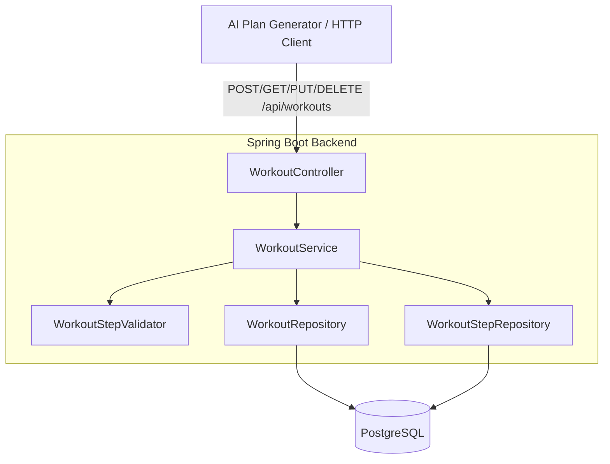

# Design Document: workouts

## Overview

This feature introduces Garmin FIT-compatible Workout and WorkoutStep entities into the AI Trainer backend. It provides a full CRUD REST API under `/api/workouts` for programmatic management of structured training sessions. The feature is backend-only (no UI) — workouts are created and managed by the AI training plan generator.

Key design decisions:
- **Garmin FIT SDK alignment**: Enumerations and value encodings (HR, Power) mirror the FIT SDK to ensure future FIT file export compatibility without data transformation.
- **Full replacement semantics on update**: PUT replaces the entire workout including all steps, simplifying the API contract and avoiding partial-update complexity.
- **Rich validation layer**: A dedicated `WorkoutStepValidator` enforces FIT SDK constraints (duration/target type combinations, repeat step rules, nested repeat prevention) at the service level before persistence.
- **UUID identifiers**: Both Workout and WorkoutStep use UUIDs for globally unique, client-friendly identifiers.
- **Ownership isolation**: Users can only access their own workouts; attempts to access another user's workout return 404 (not 403) to avoid leaking existence information.

---

## Architecture



**Request flow:**

1. An authenticated HTTP client sends a request to `/api/workouts/**`.
2. Spring Security's `JwtAuthFilter` validates the JWT and sets the `SecurityContext`.
3. `WorkoutController` extracts the authenticated `User` via `@AuthenticationPrincipal` and delegates to `WorkoutService`.
4. For create/update operations, `WorkoutService` invokes `WorkoutStepValidator` to enforce FIT SDK constraints.
5. On validation success, the service persists/updates entities via Spring Data JPA repositories.
6. The response DTO is constructed and returned with the appropriate HTTP status.

---

## Components and Interfaces

### `WorkoutController` — `com.trainer.workout`

```
POST   /api/workouts          → CreateWorkoutRequest  → WorkoutResponse (201) | ErrorResponse (400)
GET    /api/workouts           → ?sportType=RUNNING    → List<WorkoutSummaryResponse> (200) | ErrorResponse (400)
GET    /api/workouts/{id}      → (no body)             → WorkoutResponse (200) | ErrorResponse (404)
PUT    /api/workouts/{id}      → UpdateWorkoutRequest  → WorkoutResponse (200) | ErrorResponse (400/404)
DELETE /api/workouts/{id}      → (no body)             → (204) | ErrorResponse (404)
```

All endpoints require authentication (JWT). The authenticated user's ID is extracted from the `SecurityContext`.

### `CreateWorkoutRequest` / `UpdateWorkoutRequest` (validated DTO)

| Field | Type | Constraints |
|-------|------|-------------|
| name | `String` | `@NotBlank`, `@Size(max = 50)` |
| sportType | `String` | `@NotNull`, must match `SportType` enum |
| subSport | `String` | optional, must match `SubSport` enum when present |
| steps | `List<WorkoutStepRequest>` | `@NotEmpty`, `@Size(max = 50)`, `@Valid` |

### `WorkoutStepRequest` (validated DTO)

| Field | Type | Constraints |
|-------|------|-------------|
| stepName | `String` | optional, `@Size(max = 50)` |
| intensity | `String` | `@NotNull`, must match `Intensity` enum |
| durationType | `String` | `@NotNull`, must match `DurationType` enum |
| durationValue | `Integer` | nullable, validated contextually by `WorkoutStepValidator` |
| targetType | `String` | `@NotNull`, must match `TargetType` enum |
| targetValueLow | `Integer` | nullable, validated contextually |
| targetValueHigh | `Integer` | nullable, validated contextually |
| notes | `String` | optional, `@Size(max = 255)` |

### `WorkoutResponse`

```json
{
  "id": "a1b2c3d4-...",
  "name": "Tempo Run",
  "sportType": "RUNNING",
  "subSport": null,
  "numValidSteps": 5,
  "createdAt": "2024-01-15T10:30:00Z",
  "updatedAt": "2024-01-15T10:30:00Z",
  "steps": [
    {
      "id": "e5f6g7h8-...",
      "stepOrder": 0,
      "stepName": "Warm Up",
      "intensity": "WARMUP",
      "durationType": "TIME",
      "durationValue": 600000,
      "targetType": "HEART_RATE",
      "targetValueLow": 60,
      "targetValueHigh": 70,
      "notes": "Easy jog"
    }
  ]
}
```

### `WorkoutSummaryResponse` (list endpoint — no steps)

```json
{
  "id": "a1b2c3d4-...",
  "name": "Tempo Run",
  "sportType": "RUNNING",
  "subSport": null,
  "numValidSteps": 5,
  "createdAt": "2024-01-15T10:30:00Z",
  "updatedAt": "2024-01-15T10:30:00Z"
}
```

### `WorkoutService` — `com.trainer.workout`

| Method | Description |
|--------|-------------|
| `createWorkout(Long userId, CreateWorkoutRequest)` | Validates steps, persists workout + steps, returns full response |
| `getWorkouts(Long userId, SportType sportType)` | Returns summaries for user, optionally filtered by sport type |
| `getWorkout(Long userId, UUID workoutId)` | Returns full workout with steps, 404 if not found or not owned |
| `updateWorkout(Long userId, UUID workoutId, UpdateWorkoutRequest)` | Full replacement of workout + steps |
| `deleteWorkout(Long userId, UUID workoutId)` | Deletes workout (cascade deletes steps), 404 if not found/owned |

### `WorkoutStepValidator` — `com.trainer.workout`

A Spring `@Component` that validates the list of `WorkoutStepRequest` objects against FIT SDK constraints:

```java
public void validate(List<WorkoutStepRequest> steps)
    throws WorkoutValidationException
```

Validation rules implemented:
1. Duration value range checks based on `durationType`
2. Target value range checks based on `targetType`
3. `targetValueLow <= targetValueHigh` for ranged targets
4. Repeat step: `durationValue` references a valid preceding step index
5. Repeat step: `targetValue` (repetitions) in [1, 100]
6. Repeat step: `intensity` must be REST, `targetType` must be OPEN
7. No nested repeats: the range between a repeat's `durationValue` and its index must not contain another repeat step

### Enumerations — `com.trainer.workout`

```java
public enum SportType { RUNNING, CYCLING, SWIMMING, OTHER }

public enum SubSport { GENERIC, TREADMILL, TRAIL, TRACK, OPEN_WATER, LAP_SWIMMING }

public enum Intensity { ACTIVE, REST, WARMUP, COOLDOWN, RECOVERY, INTERVAL }

public enum DurationType {
    TIME, DISTANCE, HR_LESS_THAN, HR_GREATER_THAN,
    CALORIES, OPEN, POWER_LESS_THAN, POWER_GREATER_THAN,
    REPEAT_UNTIL_STEPS_COMPLETE
}

public enum TargetType { SPEED, HEART_RATE, CADENCE, POWER, OPEN }
```

### `WorkoutRepository` — `com.trainer.workout`

Extends `JpaRepository<Workout, UUID>`:
- `List<Workout> findByUserIdOrderByCreatedAtDesc(Long userId)`
- `List<Workout> findByUserIdAndSportTypeOrderByCreatedAtDesc(Long userId, SportType sportType)`
- `Optional<Workout> findByIdAndUserId(UUID id, Long userId)`

### `WorkoutStepRepository` — `com.trainer.workout`

Extends `JpaRepository<WorkoutStep, UUID>`:
- `void deleteByWorkoutId(UUID workoutId)`

---

## Data Models

### Database Tables (Flyway migration V3)

#### `trainer.workouts`

| Column | Type | Constraints |
|--------|------|-------------|
| id | UUID | PRIMARY KEY, DEFAULT gen_random_uuid() |
| user_id | BIGINT | NOT NULL, FK → trainer.users(id) |
| name | VARCHAR(50) | NOT NULL |
| sport_type | VARCHAR(20) | NOT NULL |
| sub_sport | VARCHAR(30) | nullable |
| num_valid_steps | INTEGER | NOT NULL, CHECK (num_valid_steps > 0) |
| created_at | TIMESTAMPTZ | NOT NULL DEFAULT NOW() |
| updated_at | TIMESTAMPTZ | NOT NULL DEFAULT NOW() |

Indexes:
- `idx_workouts_user_id` on `user_id`

#### `trainer.workout_steps`

| Column | Type | Constraints |
|--------|------|-------------|
| id | UUID | PRIMARY KEY, DEFAULT gen_random_uuid() |
| workout_id | UUID | NOT NULL, FK → trainer.workouts(id) ON DELETE CASCADE |
| step_order | INTEGER | NOT NULL, CHECK (step_order >= 0) |
| step_name | VARCHAR(50) | nullable |
| intensity | VARCHAR(20) | NOT NULL |
| duration_type | VARCHAR(40) | NOT NULL |
| duration_value | INTEGER | nullable |
| target_type | VARCHAR(20) | NOT NULL |
| target_value_low | INTEGER | nullable |
| target_value_high | INTEGER | nullable |
| notes | VARCHAR(255) | nullable |

Constraints:
- UNIQUE (`workout_id`, `step_order`)

Indexes:
- `idx_workout_steps_workout_id` on `workout_id`

### JPA Entities

#### `Workout` entity — `com.trainer.workout`

```java
@Entity
@Table(name = "workouts", schema = "trainer")
public class Workout {
    @Id
    @GeneratedValue(strategy = GenerationType.UUID)
    private UUID id;

    @Column(name = "user_id", nullable = false)
    private Long userId;

    @Column(nullable = false, length = 50)
    private String name;

    @Enumerated(EnumType.STRING)
    @Column(name = "sport_type", nullable = false, length = 20)
    private SportType sportType;

    @Enumerated(EnumType.STRING)
    @Column(name = "sub_sport", length = 30)
    private SubSport subSport;

    @Column(name = "num_valid_steps", nullable = false)
    private Integer numValidSteps;

    @OneToMany(mappedBy = "workout", cascade = CascadeType.ALL, orphanRemoval = true)
    @OrderBy("stepOrder ASC")
    private List<WorkoutStep> steps = new ArrayList<>();

    @Column(name = "created_at", nullable = false, updatable = false)
    private OffsetDateTime createdAt;

    @Column(name = "updated_at", nullable = false)
    private OffsetDateTime updatedAt;

    @PrePersist
    void prePersist() { ... }

    @PreUpdate
    void preUpdate() { ... }
}
```

#### `WorkoutStep` entity — `com.trainer.workout`

```java
@Entity
@Table(name = "workout_steps", schema = "trainer",
       uniqueConstraints = @UniqueConstraint(columnNames = {"workout_id", "step_order"}))
public class WorkoutStep {
    @Id
    @GeneratedValue(strategy = GenerationType.UUID)
    private UUID id;

    @ManyToOne(fetch = FetchType.LAZY)
    @JoinColumn(name = "workout_id", nullable = false)
    private Workout workout;

    @Column(name = "step_order", nullable = false)
    private Integer stepOrder;

    @Column(name = "step_name", length = 50)
    private String stepName;

    @Enumerated(EnumType.STRING)
    @Column(nullable = false, length = 20)
    private Intensity intensity;

    @Enumerated(EnumType.STRING)
    @Column(name = "duration_type", nullable = false, length = 40)
    private DurationType durationType;

    @Column(name = "duration_value")
    private Integer durationValue;

    @Enumerated(EnumType.STRING)
    @Column(name = "target_type", nullable = false, length = 20)
    private TargetType targetType;

    @Column(name = "target_value_low")
    private Integer targetValueLow;

    @Column(name = "target_value_high")
    private Integer targetValueHigh;

    @Column(length = 255)
    private String notes;
}
```

---

## Correctness Properties

*A property is a characteristic or behavior that should hold true across all valid executions of a system — essentially, a formal statement about what the system should do. Properties serve as the bridge between human-readable specifications and machine-verifiable correctness guarantees.*

This feature has strong property-based testing applicability in the validation logic (wide input space of duration types, target types, value ranges, and structural constraints like repeat steps) and CRUD round-trip semantics. The `WorkoutStepValidator` is a pure validation function with complex conditional logic — an ideal PBT target.

---

### Property 1: Workout data round-trip

*For any* valid workout payload (name 1–50 chars, valid sportType, optional valid subSport, 1–50 steps each with valid intensity/durationType/targetType and contextually valid duration and target values), creating the workout via POST and then retrieving it via GET `/api/workouts/{id}` SHALL return a response where name, sportType, subSport, numValidSteps, and every step's fields (stepName, intensity, durationType, durationValue, targetType, targetValueLow, targetValueHigh, notes) match the submitted values, and numValidSteps equals the number of steps submitted.

**Validates: Requirements 1.1, 1.7, 1.9, 3.2**

---

### Property 2: Invalid workout-level field rejection

*For any* workout request payload that contains exactly one invalid workout-level field (name blank or > 50 chars, sportType not in SportType enum, subSport not in SubSport enum when provided, or steps list empty or > 50 entries), the API SHALL return HTTP 400.

**Validates: Requirements 1.2, 1.3, 1.4, 1.5, 1.6, 1.8**

---

### Property 3: Duration value range enforcement

*For any* WorkoutStep with a given `durationType`, if `durationValue` is outside the valid range for that type (TIME: [1000, 86400000], DISTANCE: [1, 100000000], CALORIES: [1, 10000], HR_LESS_THAN/HR_GREATER_THAN: [0, 100] ∪ [101, 350], POWER_LESS_THAN/POWER_GREATER_THAN: [0, 1000] ∪ [1001, 2500]), the API SHALL return HTTP 400 identifying the step index and field.

**Validates: Requirements 2.4, 2.5, 2.6, 2.8, 2.9**

---

### Property 4: Target value range and ordering enforcement

*For any* WorkoutStep with a given `targetType`, if `targetValueLow` or `targetValueHigh` is outside the valid range for that type (SPEED: [1, 100000], HEART_RATE: [0, 100] ∪ [101, 350], CADENCE: [0, 255], POWER: [0, 1000] ∪ [1001, 2500]), or if `targetValueLow > targetValueHigh`, the API SHALL return HTTP 400 identifying the step index and field.

**Validates: Requirements 2.12, 2.13, 2.14, 2.15**

---

### Property 5: Repeat step constraint enforcement

*For any* WorkoutStep with `durationType` of REPEAT_UNTIL_STEPS_COMPLETE, if the step's `durationValue` is not a valid zero-based index referencing a preceding step (>= 0 and < current step index), OR `targetValue` (repetitions) is not in [1, 100], OR `intensity` is not REST, OR `targetType` is not OPEN, the API SHALL return HTTP 400.

**Validates: Requirements 2.10, 2.11, 2.23**

---

### Property 6: No nested repeats

*For any* workout step list containing a repeat step whose range (from `durationValue` index to the repeat step's own index) contains another step with `durationType` REPEAT_UNTIL_STEPS_COMPLETE, the API SHALL return HTTP 400 indicating nested repeats are not supported.

**Validates: Requirements 2.20**

---

### Property 7: Step ordering invariant

*For any* successfully created or updated workout, the response's steps array SHALL have each step's `stepOrder` equal to its zero-based position in the array (step at index i has stepOrder == i).

**Validates: Requirements 2.19**

---

### Property 8: Workout list ordering

*For any* user with multiple workouts, a GET to `/api/workouts` SHALL return workouts ordered by `createdAt` descending (most recent first), and each entry SHALL contain metadata fields but no steps array.

**Validates: Requirements 3.1**

---

### Property 9: Sport type filter correctness

*For any* user with workouts of mixed sport types, a GET to `/api/workouts?sportType=X` SHALL return only workouts where `sportType` equals X, and SHALL return all such workouts belonging to that user.

**Validates: Requirements 3.6**

---

### Property 10: Full replacement semantics on update

*For any* existing workout with M steps, when a PUT request provides N new steps (where N ≠ M), the response SHALL contain exactly N steps matching the submitted data, with no remnants of the previous steps.

**Validates: Requirements 4.1, 4.2**

---

### Property 11: Delete removes workout and all steps

*For any* existing workout owned by the authenticated user, after a successful DELETE (204), a subsequent GET to `/api/workouts/{id}` SHALL return 404, and no WorkoutStep records for that workout SHALL exist in the database.

**Validates: Requirements 5.1, 6.3**

---

## Error Handling

| Scenario | HTTP Status | Response body |
|----------|-------------|---------------|
| Validation failure (field out of range, missing required field) | 400 | `{ "message": "...", "field": "<fieldName>" }` |
| Step validation failure | 400 | `{ "message": "...", "stepIndex": 2, "field": "durationValue" }` |
| Invalid UUID format in path | 400 | `{ "message": "Invalid identifier format" }` |
| Invalid sportType query parameter | 400 | `{ "message": "Invalid sport type", "field": "sportType" }` |
| Workout not found (or not owned) | 404 | `{ "message": "Workout not found" }` |
| Missing/invalid/expired JWT | 401 | (handled by Spring Security filter — no body or `{ "message": "Unauthorized" }`) |
| Unexpected server error | 500 | `{ "message": "An unexpected error occurred" }` |

**Implementation notes:**
- Add `WorkoutNotFoundException` and `WorkoutValidationException` to the existing `GlobalExceptionHandler`.
- `WorkoutValidationException` carries a list of step-level errors (stepIndex + field + message) for batch reporting.
- Invalid UUID path variables are caught via a `@ExceptionHandler(MethodArgumentTypeMismatchException.class)` returning 400.
- Ownership checks use `findByIdAndUserId` — if the query returns empty, throw `WorkoutNotFoundException` (returns 404 regardless of whether the workout exists for another user).

---

## Testing Strategy

### Backend

**Unit tests (JUnit 5 + Mockito)**
- `WorkoutService`: create success, get by id (owned/not-owned), list (with/without filter), update (full replacement), delete (owned/not-owned)
- `WorkoutStepValidator`: specific examples for each duration type and target type, repeat step edge cases, nested repeat detection
- `WorkoutController`: request validation (Bean Validation annotations), response mapping, HTTP status codes
- Error scenarios: blank name, oversized name, invalid enums, empty steps, >50 steps

**Property-based tests (jqwik)**

jqwik is already in `pom.xml` as a test dependency. Each property test runs a minimum of 100 iterations (`@Property(tries = 100)`). Tag format in comments: `Feature: workouts, Property <N>: <property_text>`.

| Property | Test class | Generator |
|----------|-----------|-----------|
| 1 — Workout data round-trip | `WorkoutServicePropertyTest` | `@Provide` valid workout arbitraries (random name 1–50 chars, random SportType, optional SubSport, 1–50 valid steps with contextually valid values) |
| 2 — Invalid workout-level field rejection | `WorkoutValidationPropertyTest` | Generate payloads with exactly one invalid workout-level field |
| 3 — Duration value range enforcement | `WorkoutStepValidatorPropertyTest` | For each DurationType, generate durationValues outside valid range |
| 4 — Target value range and ordering enforcement | `WorkoutStepValidatorPropertyTest` | For each TargetType, generate target value pairs outside range or with low > high |
| 5 — Repeat step constraint enforcement | `WorkoutStepValidatorPropertyTest` | Generate repeat steps with invalid index, reps, intensity, or targetType |
| 6 — No nested repeats | `WorkoutStepValidatorPropertyTest` | Generate step lists with nested repeat structures |
| 7 — Step ordering invariant | `WorkoutServicePropertyTest` | Generate valid workouts, verify stepOrder == index |
| 8 — Workout list ordering | `WorkoutServicePropertyTest` | Create N workouts, verify list ordering |
| 9 — Sport type filter correctness | `WorkoutServicePropertyTest` | Create workouts with mixed sport types, verify filter |
| 10 — Full replacement on update | `WorkoutServicePropertyTest` | Create with M steps, update with N steps, verify N steps in result |
| 11 — Delete removes workout and steps | `WorkoutServicePropertyTest` | Create, delete, verify 404 on GET |

**Integration tests (Spring Boot Test + H2)**
- Full request/response cycle for POST, GET, PUT, DELETE against in-memory database
- Authentication enforcement (401 without token)
- Ownership isolation (user A cannot access user B's workouts — returns 404)
- Cascade delete verification (no orphan steps after workout deletion)
- Flyway migration runs successfully (schema validation passes)
